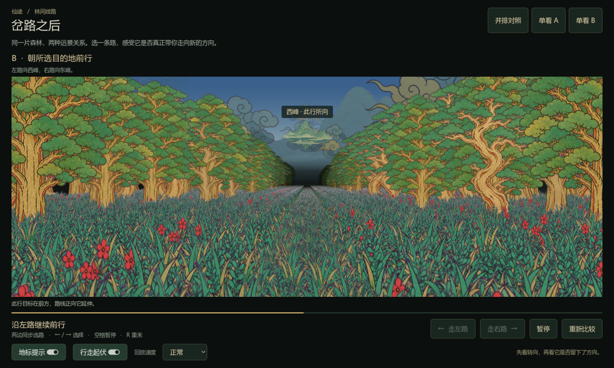
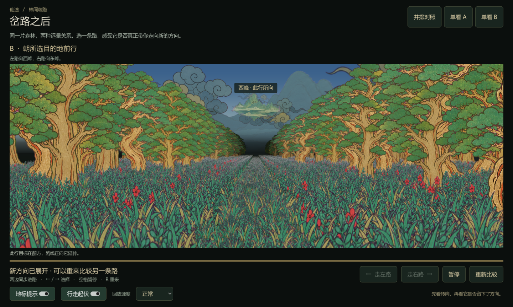

# 局内冒险表现设计案：方向、纵深与多主题迁移

更新：2026-09-06。知识库中的当前设计基线。作者在森林方向、天空遮挡、大气雾、地平线幽暗与分层云修正后反馈“很不错”；认可范围是本轮森林小样，不是所有主题、所有设备或完整游戏验收。

后续进展：已建立空间类型/路段/过渡结构，以及洞穴、云海、连续进入小样，尚待作者验收。详见 [空间类型与连续过渡](SPACE-TYPES-AND-TRANSITIONS.md)。下文森林参数仍作为已认可基线。

## 1. 设计目的与不可退步项

少量已有 2D 资产，以连续投影、遮挡、层次和运动营造真实行进感。局内冒险与浮空岛是两套表现层；本案首先覆盖局内冒险，浮空岛尚未移植。

- 选路要让玩家相信进入了另一方向。不能用先偏移再回到原 X 轴的动画代替真实转向。
- 远景有世界含义：是方向参照或目的地，不能为保持构图任意吸附屏幕。
- 大气雾与路径尽头的幽暗是不同职责。森林上方仍有空气与山峰，下方通道尽头要神秘、难以看透；不能靠全屏压暗制造幽深。
- 静止时云仍有生命感；前进时空间视差与风叠加，近远层不能同速平移。
- 保留原 PNG 与已有未提交原型修改。森林导入资源有 SHA256 清单，运行时裁切、雾色与条带烘焙不覆盖原图。
- 内容、战斗和成长数值仍待设计，不因表现验收通过而固化。

## 2. 决策记录与范围

| 事项 | 当前结论 | 状态 |
| --- | --- | --- |
| A 固定世界方位 / B 分支目的地 | 作者选择 B 更好；B 默认，保留 A 对照 | 森林已认可 |
| 岔路接近过慢 | 1.8 秒接近，途中可选 | 小样已实现 |
| 选择后回主路 | 持续世界路径，转入后保持新航向 | 已验证 |
| 太阳与远山错层、错速 | 无限远太阳 + 有限远山统一透视；山遮太阳 | 已修正 |
| 地平线幽暗 | 独立渐变雾带，不破坏上方大气雾 | 作者认可最新结果 |
| 云距离感 | 三层世界云场，风与相机平移分离 | 作者认可最新结果 |
| 多数地图幽暗、洞穴末关转亮 | 支持作为主题/关卡方向讨论；尚非最终规则 | 待设计 |
| 云海原型 | 原型明确采用雾金亮尽头，不能直接套森林暗色 | 需 Godot 小样确认 |
| 洞穴 / 云海 | 已有独立与连续路段小样 | 待作者验收 |
| 浮空岛 | 原型资料已检查，尚未迁移 | 未验收 |

森林基线关键帧（真实 Godot 渲染，代表图，非精确时序黄金测试）：





## 3. 共享空间与道路算法

世界以 XZ 平面存储位置，道路用沿程距离 s 与航向 θ 表达。相机位置 C 与物件 P 的差值先旋转到相机空间，再投影：

```text
D = P - C
x_camera = D.x*cos(θ) - D.z*sin(θ)
z_camera = D.x*sin(θ) + D.z*cos(θ)
x_screen = center_x + focal*x_camera/z_camera
y_screen = horizon_y - altitude*focal/z_camera
size_screen = size_world*focal/z_camera
```

只绘制相机前方的有效深度。近景、云、地标遵守同一关系，避免每层各写一个任意镜头倍率。地面反投影与该世界坐标对应。

森林双岔：岔口 s=700，圆弧转弯段长 420，总转角 ±0.5 弧度（约 28.65°），半径 R=420/0.5=840。圆弧内 x=±R(1−cos α)，z=700+R sin α；之后沿末端切线延长，绝不自动回到旧主轴。路线终点 s=3650 是实验长度，不代表正式地图生成器已完成。

镜头朝向由前方 75 单位的路径点决定，使用 `1-exp(-4.5*dt)` 平滑；岔路清障同时考虑所有分支，不能移动整面树墙伪造出口。下一阶段洞穴拱顶也必须沿路径位置与切线排布，而不是沿旧直线轴排列。

B 的目标放在对应路径 s=18000 的世界位置；转入后自然接近正前方。A 保留独立世界位置作为参照。B 是森林当前主方案，不要求所有地图都出现远山：洞穴需用入口、岩壁轮廓或局部视觉线索表达分支。

## 4. 天空、地标和遮挡

太阳按固定世界方位角 0.22 与仰角 0.43 投影，不受相机平移影响；水平转向同时影响投影 X、Y 和尺寸，不能固定屏幕 Y。当前只验证固定太阳，完整昼夜循环尚未移植。

背景山位于世界 Z=90000 的宽平面，分 96 段投影，避免宽幅贴图内部山峰仍以错误比例横滑。雾感通过 RGB 混合保留，轮廓 alpha 不整体降低，防止太阳透山。

当前顺序：天空/地面底图 → 太阳 → 背景山 → 云与目的地按相机深度混排 → 地平线氛围雾带 → 林木与草地按深度绘制 → 轻微环境色 → 可关闭的地标提示。提示文字是 UI，不能据其遮挡位置判断地标真实深度。

## 5. 大气雾与路径尽头

`haze_color` 管远景空气色，`depth_color` 管通道尽头颜色。渐变雾带的最强处在地平线，向上 0.22 画幅高度、向下 0.30 画幅高度平滑衰减，森林强度 0.94。这层画在近景之前，近树不会因为屏幕高度穿过雾带而整棵跳暗。

森林当前 depth_color=(0.015,0.027,0.025)，haze_color=(0.43,0.56,0.63)。上方山峰、云与空气仍然可读，下方趋于幽暗。近景另有基于实际距离的连续压暗与远端淡入。

**实现边界**：当前资源可改雾带目标色，但近景 tint、地面 shader 等仍含森林参数。完整亮雾主题必须同时迁移精灵深度染色、地面/云面和环境色，不能只改一个 depth_color 就宣称云海完成。配置目前在加载时建立；实时天气插值及切换时缓存重建尚未实现。

## 6. 三层云场与统一编排

`SkyField` 以主题种子、层号和世界网格坐标确定每朵云的位置扰动、尺寸、高度和素材变体。相机仅查询周边网格；移动、转向、跨网格不重掷已有云的位置。

静止时：世界 X 叠加层风速×时间，加小幅连续阵风；世界 Z 不自动向近处输送。前进时：由相机平移产生深度变化，投影自然上移、放大；同一仰角下越近视差越强。不同云的高度和离轴角也会影响屏幕速度，不能要求任意两朵云机械地保持同一速度排序。

| 层 | 距离带 | 网格间距 | 基准高度 | 基准宽度 | 横向风速/秒 | 不透明度 |
| --- | --- | --- | --- | --- | --- | --- |
| 近 | 7000–23000 | 10500 | 4200 | 6500 | 48 | 0.58 |
| 中 | 24000–48000 | 17000 | 10500 | 10000 | 38 | 0.44 |
| 远 | 49000–82000 | 26000 | 22000 | 14000 | 27 | 0.30 |

均为实验世界单位，不是米。距离带按到相机的平面距离渐显/渐隐，不按硬阈值突然出现；绘制排序使用相机深度。近云可遮目的地，远云在目的地后。A/B 共享场景、时钟与查询缓存，不能各自随机云。

停步继续横向风，暂停冻结公共时间，重来归零；帧率或视图切换不能改变布局。云海的脚下云面和侧面云墙不是这套天空云的别名，仍需各自的形体生成与较慢漂移规则。

## 7. 多主题：已理解的差异与待验证事项

| 模块 | 森林当前 Godot | 洞穴原型 | 云海原型 |
| --- | --- | --- | --- |
| 空间轮廓 | 树冠与草地围出通道 | 岩柱 + 连续岩环拱顶，封闭空间 | 高云墙围出云谷，脚下层叠云面 |
| 天空 | 日、云、远山启用 | 无日月、祥云或远山，顶部近黑冷紫 | 开放天空、日月祥云与浮空仙山 |
| 深度归宿 | 暗雾尽头 + 上方空气 | 暗紫过渡至黑暗 | 精灵与雾带趋向 #e8d9b9 亮雾 |
| 地面 | 地面纹理与高低草条带 | 地面纹理、碎石石笋与少量点缀 | 无普通地面纹理，云条带全宽铺满 |
| 特殊几何 | 道路净空与植被布局 | 岩环原型间距 250、尺寸 724，需统一排序 | 云墙、全宽条带、14 个浮石及悬浮参数 |
| 特殊运动 | 天空分层风、真实岔路 | 原型弯曲倍率 1.3；新路径需重新适配岩环 | 原型弯曲倍率 1.1；云面慢横漂、浮石起伏 |
| 验收风险 | 当前森林基线已认可 | 转弯裂缝、拱顶穿模、岩片穿屏、出口像天空破洞 | 硬裁剪直边、亮雾变黑、云面像草地、云墙重复、目标被遮死 |

源码机制已核对不等于新版视觉体验已通过。原型截图只能证明某个时刻的表现，不能证明完整连续转弯与回收。现有 Godot 类名、素材加载、地面 shader 与部分深度参数仍偏森林，正式扩展应拆分共享路径/投影/主题氛围与主题专属布局，禁止把所有差异塞入一串主题判断。

## 8. 验证计划（首轮小样已实施，待验收）

建议顺序：洞穴 → 云海 → 三主题连续切换 → 浮空岛迁移。先补齐局内两类，与森林共用已有控制、回放与诊断。

每个主题交付独立可试玩场景：静止观察 → 前进 → 左右岔路 → 持续新方向 → 暂停/重来；使用原最终素材，对照原型录取代表帧和连续回放。不能只给静态截图或把森林素材替换后宣称完成。

洞穴验收：直行时连续包围、转弯时拱顶与岩壁无裂缝；岔口清楚但不出现天空；越远越暗仍有深度层次；近岩经过无骤亮或翻片。特殊亮出口可以单独做第二个变体，但是否属于末关、亮度与叙事意义由作者确认。

云海验收：脚下是完整层叠云面，没有地面色块或裁剪直边；高空云、侧壁云、脚下云、浮石有各自清楚的距离与节奏；远方亮雾不退成黑洞；目标山保持方向意义；两侧岔路在亮雾中仍可读。原型采用亮尽头，作者提出多数地图幽暗，云海是否保留为例外需小样对照后决定。

主题切换验收：旧主题资源/天空不残留，原型淡出→黑幕切换→淡入节奏作为参考；不是当前已实现能力。

## 9. 证据、测试与维护

- [Godot 操作与实现入口](../../godot/README.md)
- [路径算法](../../godot/scripts/route.gd)、[投影与排序](../../godot/scripts/corridor_renderer.gd)
- [氛围参数](../../godot/scripts/atmosphere_profile.gd)、[森林配置](../../godot/profiles/forest.tres)、[世界云场](../../godot/scripts/sky_field.gd)
- [原型渲染技术案](../tech/CORRIDOR.md)、[原型素材规范](../../assets/corridor/SCENE-SPEC.md)
- [迁移评估与原型截图](../migration/GODOT-ASSESSMENT.md)

已运行路线连续性/对称性/持续航向测试、输入与暂停重来测试、天空平移不变性/分层风/等仰角距离视差/网格世界位置稳定/主题资源隔离测试。原生 GPU 回放检查了转入和持续方向关键帧；鼠标自动回归受窗口捕获工具限制，不能记为完整鼠标验收。

测试版本 Godot 4.7.1，Compatibility/OpenGL，本机 RTX 3060。截图回放帧时包含截图停顿，不能用来宣称正式版帧率保证。尚未完成多设备、多分辨率、完整昼夜、长期回收压力测试及三主题串联。

维护规则：每次作者认可一版，同步更新决策表、参数和代表图；争议项标记为待确认，不把建议写成已定规则。代码与文档不一致时应核对实际实现，并记录变更范围，保留已认可视觉基线供回归。
