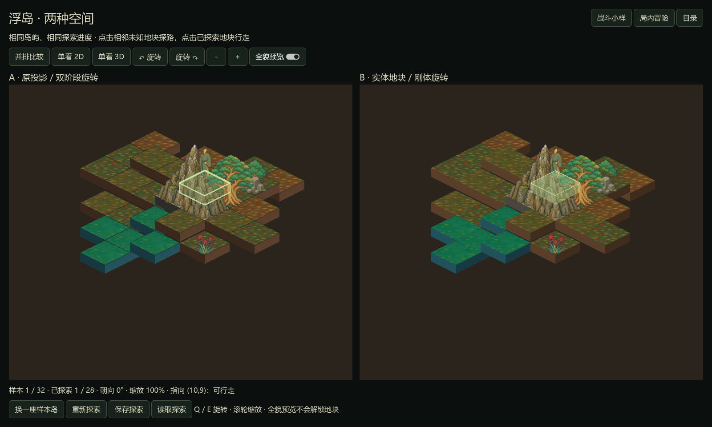
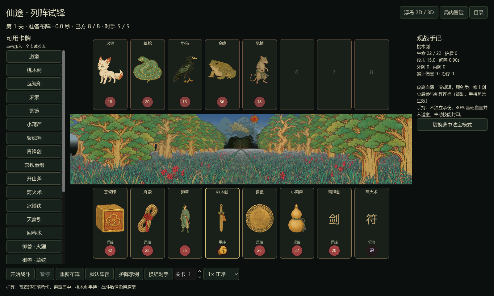

# 战斗与浮岛双方案 · Godot 样本

日期：2026-09-06。状态：三个可运行样本已实现，待作者试玩确认；不代表整款游戏、成长系统或最终数值已完成。

## 1. 交付与入口

运行 `godot/run.ps1` 打开样本目录。也可分别用 `-Battle`、`-World`、`-Spaces`、`-Forest`。Godot 测试版本为 4.7.1 stable，Compatibility / OpenGL，Windows，RTX 3060。原有森林表现保留独立入口。

| 样本 | 可实际操作的内容 |
| --- | --- |
| 战斗 | 24 张原型卡牌试验库、加入/移除、拖动换位、法宝手持/操控、识海法术与御兽、开始/暂停/重来、关卡参数、换敌、速度控制、技能弹道、尸体与重聚、胜负结算和伤害/治疗记录 |
| 世界 A | 原有二维投影、顶面纹理映射、侧面几何、双阶段旋转、深度排序、逐格探索、视线与多级迷雾、悬停遮挡透视、行走和缩放 |
| 世界 B | 真实 BoxMesh 地块、纹理顶面、正交 Camera3D、整体刚体旋转、2D 山树人物、深度缓冲遮挡、射线选格，以及与 A 共用的探索/行走/迷雾 |

世界的并排、单看 A、单看 B 共用同一个 IslandModel，不重新生成另一座岛。全貌预览只改变可见地貌，不解锁行动范围。Q/E、A/D、左右键旋转；滚轮缩放。存档按钮将探索保存在 Godot `user://island_study.json`，只属于本样本。

## 2. 战斗迁移契约

数据来自原 `js/unit.js` 与 `js/balance.js`，由 `scripts/export_native_reference.mjs` 导出。基础数值不在移植中擅自重新平衡。`BattleRules` 负责属性、防御、伤害、治疗和队列修正，`BattleModel` 负责行动、弹道到达、死亡/重聚及结束状态，`BattleArena` 与 `BattleCard` 负责表现和输入。UI 不自行扣血。

攻击选择最左存活且可承伤单位；尸体保留原位。手持法宝和识海法术不占承伤位。手持法宝将血量按原比例合并给道童，主动技封印而被动保留；卡面用拳头替代独立血量球。操控法宝死亡后原位计时重聚。治疗、护盾、相邻加速、溅射、剑阵追击、幡魂、反伤、法术群攻/延迟/单体/治疗均由规则层执行。

按固定 1/120 秒步长推进；慢放或快进改变积累的仿真时间，暂停冻结仿真。弹道到达后结算伤害，结算信号只发出一次。沿用原型的八类正式飞行道具；原卡牌没有立绘的条目保留文字符号，不冒充已补齐美术资产。

**本轮明确修正的原型边界行为**：原网页等待 `inflight == 0` 才判胜负，但主角倒下后其他单位仍可能继续创建弹道，延迟战败。本样本在终局条件出现后停止新行动，只处理已经飞出的弹道，然后结算；若在途弹道同时清空敌人，可形成平局。其余战斗基础数值和技能计算以原型对照为准。

默认阵容保留道童在前，容易迅速战败。“护阵示例”把瓦瓷印、麻索置前，桃木剑手持、道童居中，加入离火术；在原第 1 关对手下可胜利。两者展示布阵意义，不代表战斗平衡已定。自由御兽库是试验入口，尚未接捕获、消耗和成长存档。

## 3. 世界共同模型

网格坐标 `(c,r)` 转为平面世界位置 `((c-r)/2,(c+r)/2)`。高度独立保存。源地块厚度为 0.88 高度单位，每次旋转 45°、300ms，每步行走 360ms，沿途采用二次缓入缓出与 4px 抬身。

只有到达的格子才进入 explored；视线范围不直接揭示地貌。视野使用曼哈顿半径，地势高时增加，林地减少；中间山脊、更高地块或缺失地块会阻断视线。未知显示雾地台，邻接已探索的边界脉冲提示；已探索但离开视野使用压暗、降饱和记忆样式。

寻路只经过已探索格，可以以一个相邻未知格为终点。预览全貌不会突破这一规则。移动中不旋转；同向旋转允许缓存下一步。存档加载先校验目标位置再替换当前地图，非法目标不会清空现有探索。

**数据范围**：当前是原 `world-demo.html` 生成器导出的 32 座固定种子样本岛，种子 1842–1873。换岛在这 32 座之间循环，目的是可复现地比较两套渲染；没有宣称已完成 Godot 原生无限地图生成器。JSON 记录了源 HTML 的 SHA256，包含作者工作区中的现有修改。原 HTML 未被迁移代码改写。

## 4. A 与 B 的算法差别

| 项目 | A：保留原投影 | B：真实实体 |
| --- | --- | --- |
| 相机 | 手工 `x=112·X`、`y=56·Z−22·H`，统一缩放 | 30° 俯角正交相机；高度单位换算 `22/(112·cos30°)`，保持同一屏幕比例 |
| 旋转 | 中心按全程余弦缓动；局部角点只在 40%–60% 区间转动 | 地块中心与角点使用同一个全程角度，保持刚体关系 |
| 地块 | 顶面四边形纹理映射，侧面多边形绘制与排序 | 立方体边长 `sqrt(0.5)`，真实厚度，独立纹理顶面与方向侧色 |
| 山树人物 | 精灵按深度在角色前后绘制 | 朝向镜头的 QuadMesh；保留透明软边，深度预通道处理不透明主体 |
| 点选 | 当前投影顶面多边形，选最近可到达格 | 相机射线与实际旋转后的顶面相交，选最近可到达格 |
| 遮挡提示 | 目标轮廓遮罩 × 前景遮罩，仅交叠处淡色透视 | 采样场景深度重建视空间深度，仅被挡住的部分透视；交互轮廓最后绘制 |

两套渲染到达整 45° 朝向后，地块中心投影一致；旋转中 A 的局部延迟会出现短暂分离，B 保持地块之间刚性拼接。这是对照变量，不能把 A 也改成刚体后声称复刻了原方案。

2D 原图中的脚部可以覆盖地台下方，直接把同样锚点用于实体会被顶面切掉。本轮让立绘沿相机视线向前偏移以抬高实际脚部，同时不改变屏幕锚点。地块始终是真实几何，装饰仍是纸片；尚未支持自由俯仰、绕到物件背后查看或任意立体桥洞。

深度重建参考 [Godot 官方后处理说明](https://docs.godotengine.org/en/latest/tutorials/shaders/advanced_postprocessing.html)，通过逆投影矩阵处理深度，区分 Compatibility 的 NDC 范围，不将深度数值大小直接当远近。透明边缘仍受 [3D 透明渲染限制](https://docs.godotengine.org/en/4.7/tutorials/3d/3d_rendering_limitations.html) 约束，需要在后续新资产和复杂交叠中继续验收。

## 5. 选型判断

**建议浮岛正式路线优先继续 B，局内冒险维持已有纸片空间算法。** 这是本轮小样后的建议，最终由作者对照体验决定。

B 的明确收益是地块转动和拼接由统一实体几何保证，遮挡和点击也共用空间事实；扩展高度变化更直接。A 则能精确保留原来富有风格的双阶段运动，也更容易逐像素控制二维合成。真实 3D 不会自动解决素材锚点、半透明边缘或美术构图；山树仍需按 2D 资产管理。

## 6. 验证与本轮边界

验证入口为 `scripts/check_godot_samples.py`。本轮对照覆盖：

- 战斗原 JS：192 组属性、18 组防御/伤害、48 组行动对照，共 258 组。
- 世界原 JS：192 组不同岛屿/站位的视野与迷雾对照。
- 八个朝向下 224 个 2D/3D 地块中心投影；实际 BoxMesh 与射线选格；Godot 输入传播到寻路。
- 布阵拖放、手持血量、暂停/重来、护阵获胜、只结算一次、24 种卡牌行动、主角死亡终止新攻击。
- 原森林路线、天空、交互及洞穴/云海连续区域检查。
- 真实按钮输入往返目录、战斗、世界和连续区域；选路方向键优先于界面焦点导航。
- 原生 GPU 截图：正常探索、全貌、旋转中/结束、遮挡、单看 3D、布阵、战斗、战败/胜利、1000×650 窗口。截图位于 `godot/captures/modules-review/`，代表图复制到本知识库。

105 份最终 PNG 与源文件逐字节一致，来源见 `godot/assets/manifest.json`。截图不是性能基准；尚未承诺移动设备性能、所有 GPU 或任意地图规模。完整境界/装备/天赋 UI、世界事件与战斗之间的连续玩法循环、无限世界生成和完整游戏存档不在这三个独立样本内。新样本未被作者验收，不取代已认可森林基线的状态。
