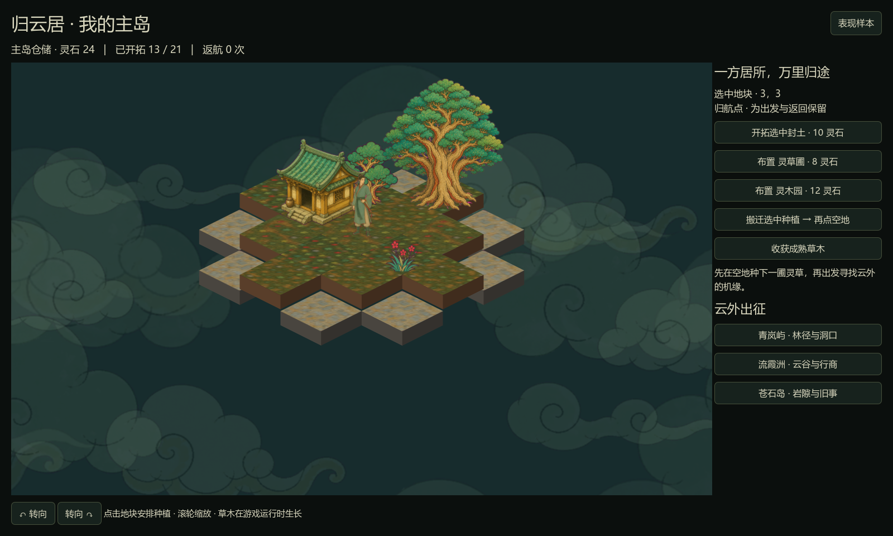
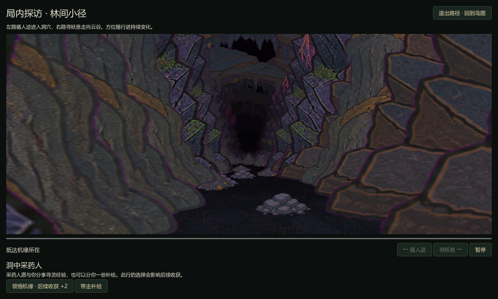

# 主岛、冒险岛与局内冒险

2026-09-06，根据作者纠正重新确立的整体结构。本文件优先于此前把连续冒险岛视为主循环的「云岫行记」试验说明。

同日补充：[战斗连续性与表现整改](BATTLE-CONTINUITY-AUDIT.md)规定局内景观与己方卡牌常驻。局内包含连续多次遭遇，单场胜利只清场并继续前进，不再立即返回岛图；下面旧联调说明中的单战返回以此修正为准。

## 游戏结构

**主岛经营与长期成长 → 出征独立冒险岛 → 方块探索 → 局内路线与事件 → 返回岛图继续探索 → 携战利品返航主岛。**

主岛是游戏开始与持续回归的居所，以方块构成，可逐步解锁、扩展和自定义布局，承载建设、放置、养成。冒险岛是单局内容容器，大小和摆排不同。局内是此前确认的少量 2D 资产模拟空间的行进层，包含岔路、森林/洞穴/云海切换、怪物、商人、NPC 与剧情。单局随机选择和临时成长叠加在长期成长之上，不取代后者。

## 本轮可玩范围

启动项目直接进入「归云居」。固定 21 格主岛，初始解锁 13 格，保留古木、小居和归航点；相邻封土可解锁。灵草圃、灵木园可在空地布置，选择原地再选择目标空地可搬迁，生长进度保留。成熟后收获，收益进入主岛仓储。小居复用画面风格生成独立透明素材；花草缩放独立于树林，不再用统一物件宽度。

从主岛选择三个出征方向，使用原型导出的 32 座不同样本，按返航次数及方向选择地图。每次出征拥有独立探索、行囊与临时机缘；进行中的出征可继续，不能被另一出征覆盖。

冒险岛上的三处入口进入已有连续空间场景。左路进入洞穴，按地图及入口序号遇到采药人、行商或旧刻事件；右路进入云谷，抵达后再布阵交战。选路一旦提交会保存，退出重进不会改变该入口的分支。暂未保存行进到具体哪一步，重进重走同一分支。

非战斗事件提供「当下补给」与「本次出征后续收益」选择。机缘只保留到返航，下一次出征清零。战斗结算后返回同一岛图。玩家可以提前返航；本岛三处探访完成后也引导返航，不自动进入下一岛。

## 状态职责与收益边界

| 层 | 状态拥有者 | 保存内容 | 生命周期 |
|---|---|---|---|
| 主岛 | HomeState | 仓储、已解锁地块、种植种类和位置、生长、返航次数 | 跨出征长期保留 |
| 出征 | JourneyState | 岛图、探索、待探访入口、已完成入口、阵容、行囊、选路、临时收益加成 | 一次出征 |
| 局内 | ExpeditionRoute + 原空间资源 | 相机、航向、行进进度、当前空间、事件界面 | 当前路线；选路归出征保存 |
| 战斗 | BattleModel | 本场实体、冷却、伤害、弹道与胜负 | 单场；阵容归出征保存 |
| 会话 | Journey | 主岛与出征持有、跨场景切换、存档及返航结算 | 游戏会话 |

行囊收益在返航前不计入主岛仓储。返航执行转移、清空行囊、关闭出征，再保存，防止重复领取。主岛收获与种植成本均由主岛模型处理；局内选项不能直接修改主岛仓储。

存档保留原行记格式并追加主岛、出征是否进行、选路和临时加成字段。初次载入不含主岛的旧行记时，会保留一份 `.before-home.json` 备份。旧试验存档的行囊不自动兑换主岛财富，也不自动当成正式出征。主岛不存在时使用初始布局。当前只保存一个进行中的出征。自动保存每 10 秒，重要操作立即保存，使用临时文件替换。

## 表现与资产管理

地块、植物/小居、角色、环境云、交互 UI 分开管理。小居与草木的占用通过网格元数据决定，图像中的像素不承担碰撞与建设规则。当前小居是固定功能地标，植物可以搬迁；尚未开放房屋自由搬迁。

森林、洞穴和云海继续使用 SpaceType / RouteRegion / RoutePlan，而非在主岛逻辑中新增一套投影算法。洞穴顶部和森林入洞过渡沿用已有空间编排，主岛云只是环境漂移，不套用局内前进的径向速度。

新素材来源与提示词见 `assets/generated/home-cottage`；运行时图像和哈希记录见 `godot/assets/generated-manifest.json`。原有 105 份素材字节保持不变。

## 试验参数与明确未完成项

初始仓储 24 灵石；封土解锁 10；草圃 8、60 秒收获 3；木园 12、90 秒收获 5。生长仅计算游戏运行时间，每处最多存一轮成熟收获，无离线收益。资源种类暂统一为灵石，未形成木料、药材、种子、装备等正式战利品系统。

固定 21 格主岛、两种种植、一个固定居所是经营基础样本；还不是完整建筑系统、主岛任意扩展或功能解锁树。局内事件是简短交互样本，不是完整剧情或商店。地图来自原型样本池，事件按稳定种子规则编排，尚未实现完整随机内容生成。卡牌试验库仍全开放，未实现出征装备限制。战败允许重试或退出，没有擅自确定战利品丢失规则。

本轮暂按「一次出征一座岛，可提前返航」实现；是否连续航行多岛、失败代价、奖励带出比例、主岛成长如何支持下一局，需要继续与作者讨论。

## 验证

`test_home.gd` 验证种植占用与成本、相邻解锁、搬迁保留进度、成熟收获只能一次、主岛序列化、真实洞穴路线和旅人选择、真实云谷路线和战斗、临时加成生效、返航只入库一次，以及新局清除临时成长而保留主岛。

`capture_home.gd` 以本机 GPU 回放主岛、种植、小窗口、局内岔路、洞穴事件。与此前森林/空间/战斗/浮岛检查一起运行。测试使用隔离存档，不覆盖玩家进度。

本轮最终 13 项检查通过；105 份原素材和 1 份新增素材来源校验通过。[验证报告](samples/home-validation.json)。

