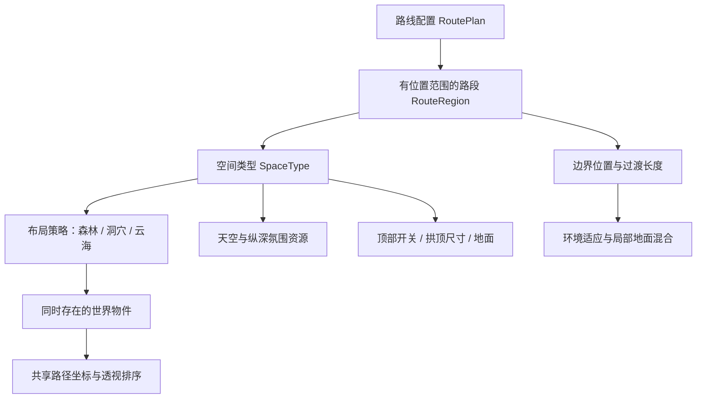
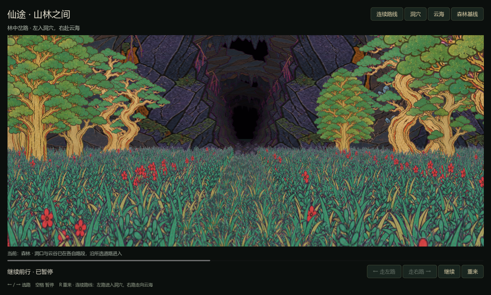
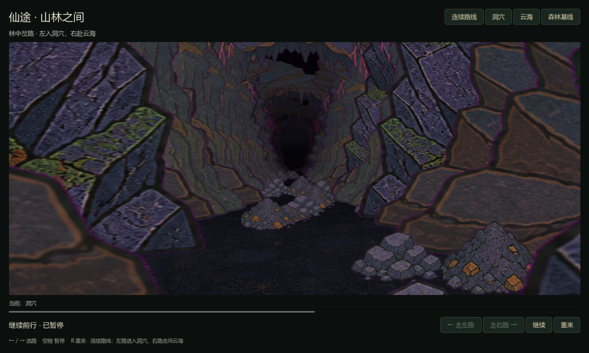
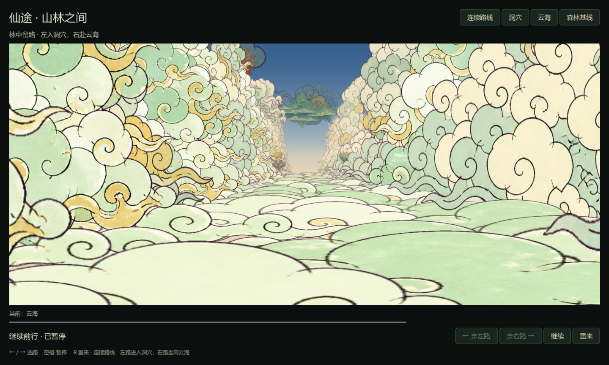

# 空间类型、路段与连续过渡

日期：2026-09-06。状态：结构已落地，洞穴/云海独立小样与森林分支连续进入小样待作者验收。森林已认可基线保持独立入口。

## 1. 作者意图

森林、洞穴、云海是空间大类，不是整局只能选一个的皮肤。一次冒险可在某条路径中，从森林看到山洞入口、接近入口、穿过入口、继续进入洞穴。顶部可以作为洞穴的可配置结构；同类可有不同高度、封闭程度与氛围。后续增加场景类型，要扩展明确职责，而不是复制整套相机和行进算法。

## 2. 已落实的层次

| 层 | 文件 | 职责 |
| --- | --- | --- |
| 空间类型 | `godot/scripts/spaces/space_type.gd` | 布局策略、氛围、天空可见、顶部能力、地面纹理与颜色、深度范围 |
| 路段 | `route_region.gd` | 稳定 ID、分支、起止沿程、使用类型、过渡长度 |
| 路线配置 | `route_plan.gd` | 查询归属、校验区段、隔离变体配置 |
| 世界实例 | `segment_world.gd` | 调用策略、保留各路段物件、生成与相机环境分离 |
| 三种布局策略 | `layouts/` | 树草布局适配、洞穴岩壁/顶部、云海云墙/云面/浮石 |
| 渲染 | `segment_renderer.gd` | 各物件按自身类型染色与按深度排序，洞口遮挡与室内可见性 |
| 地面 | `space_ground.gdshader` | 根据地面世界位置选择路段材质，在路段边界局部混合 |

配置登记位于 `godot/spaces/types/`，路线编排位于 `godot/spaces/routes/`。`.tres` 资源可在 Godot Inspector 中编辑。布局策略由资源引用 Script；渲染层不按“森林/洞穴/云海”字符串分派整套渲染器，而按天空、地面、顶部等能力和参数工作。原森林布局通过适配器保留；原森林验收入口不换成新场景。

## 3. 当前连续路线

主路是森林。分岔后左右路先各有森林段；沿程 s=1900 后，左路进入洞穴、右路进入云海。各路段的类型从位置得到，与按钮标签、动画时间、当前镜头画面无关。

同屏中的森林、洞口与洞内岩石、远处云墙真实共存。相机跨边界不清空物件、不重新随机生成，不回旧主轴。世界生成和材质归属在创建路线时确定，行进只改变相机位置及环境适应程度。

这些是本轮原生渲染的代表图，不代表作者已认可，也不是每帧完全固定的黄金测试。

## 4. 三类空间的算法职责

**森林**：复用已认可的种子布局；路段适配器按空间位置归属保留对应区间的树草。旧双视图场景仍是独立验收基线。

**洞穴**：岩柱、碎石、石笋独立排布；`ceiling_enabled` 控制是否生成连续岩拱切片，`shell_width`、`ceiling_height`、`shell_spacing` 控制尺寸与密度。天空可见与顶部开关是独立参数：没有可见顶部不自动等于天空开放。岔口作为较宽腔室处理，分支尚未分离时不重复叠两套狭窄岩环；分开后各自恢复顶部。大件对所有道路清障，不能让另一路岩壁堵住所选路线。

**云海**：侧面云墙与全宽云面分开生成；云面不按草地道路裁切，避免方形截面。浮石有独立高度与小幅起伏，脚下云面有比高空云更慢的漂移。没有普通纹理地板，底部与远处精灵共同融向雾金色。深度处理不再只乘黑色：原素材叠加目标色轮廓，按距离连续混合，保证亮雾主题不出现黑尽头。

三类空间共用 `ForestRoute` 的当前实验路径几何。这个历史类名尚未全面更名，避免无关重构；其职责是路线与投影基础，不决定视觉类型。

## 5. 边界：可见性、光照与地面必须分开

- **几何遮挡**：接近洞口时有实际投影的入口轮廓及内部暗底。近处树草可以挡住洞口。洞内物件仍在同一深度队列中。
- **室外可见性**：跨进封闭路段后不继续显示室外太阳、云和目的地。光照渐变不能让室外背景透过岩壁。其他路段的物件继续参与正常视锥与深度排序，不按跨界时刻整批删除。天空可见性目前适用于本轮单入口路线，不是任意房间的通用门户可见性系统。
- **光照适应**：从边界前 120 世界单位开始，延续到目标路段设定的过渡长度末端，采用 smoothstep。光照参数混合不改变世界物件类型。
- **地面过渡**：每个地面采样点反投影到世界位置后查路段，围绕边界混合地面颜色/纹理。不是把整幅地面跟着相机同时换成另一张图。
- **类型内状态**：暂停冻结风和浮动时间，重来恢复相机与时间；顶部配置不是依赖距离临时打开一张覆盖图。

洞口在临近镜头时自然占据更大画幅。当前入口仍是 2D 岩环与暗部投影组合，未实现可旋转任意观察的三维洞口实体；这一限制必须通过作者连续试玩判断是否满足风格要求。

## 6. 变体与资源安全

类型是可复用定义，路段是实例引用。创建“高顶洞穴”“无顶部岩道”“出口亮雾”等变体时，需要独立配置资源。`RoutePlan.copy_for_editing()` 显式复制路段、类型与氛围配置，保留只读纹理和布局 Script 引用；不能依赖普通 `duplicate(true)` 自动隔离外部 Resource。

此规则已做测试：关闭一个复制路线的顶部，不会改变原洞穴登记资源。当前仍需在加载路线时应用配置；运行中动态改结构并重建、存档版本迁移、天气事件叠加等不在本轮实现内。

## 7. 已完成检查与当前边界

已完成：

- 三份路线配置加载、相邻路段边界归属、缺口/重叠拒绝。
- 相机跨过边界时物件数量与世界位置保持，环境权重连续。
- 顶部开关实际改变岩环生成，变体不污染原类型。
- 新场景左路选择、暂停、重来和独立类型入口切换。
- 原森林路线、天空、输入测试回归通过。
- 原生渲染回放检查洞口前/临近/跨入/洞内、云海边界/内部、洞穴和云海岔口。
- 三主题共 42 份最终 PNG 经字节对照，来源清单在 `godot/assets/manifest.json`。

当前约束：固定主路与左右两支，最多 12 个路段、3 个同时使用的类型材质槽，超出会报错。地面投影中的路线查询适配当前双岔几何，尚不是任意样条路网；CPU 路段查询与地面 shader 后续应统一为路径采样数据。新场景尚未加入完整昼夜、主题特效点缀、关卡事件、战斗、碰撞、流式加载或全局地图生成器。

洞穴出去再看到森林、多重洞口同时可见、反向走出洞穴、上下层交叉路线等尚未验证。它们需要继续完善门户可见性和路径拓扑，不能因森林→洞穴单向样例通过就宣称全部支持。洞穴与云海画面仍待作者确认，近岩材质放大、岔口腔室、云墙重复与过渡节奏都是下一轮观察项。

## 8. 操作与扩展

运行：`godot/run.ps1 -Spaces`。顶部按钮在“连续路线 / 洞穴 / 云海”间切换，“森林基线”返回已认可场景。也可直接运行 `godot/scenes/space_study.tscn`。

新增类型：建立 SpaceType 资源与相应布局策略；如果只是同类变体，复制配置即可。新增路段：在 RoutePlan 中设置稳定 ID、分支、沿程范围、类型与过渡长度，再通过配置校验与边界可视化检查。若新增结构超出现有能力（例如水下折射、任意三维门户），应增加独立模块并明确接口，不能把它硬塞进云漂移或雾带参数。

验证命令见 [Godot 说明](../../godot/README.md)。森林最初认可的算法与参数见 [冒险表现设计案](ADVENTURE-PRESENTATION.md)。

## 9. 正式制作时的管理约定

作者进一步确认：同一场景内允许沿路径跨越空间大类，洞穴可以出现顶部。因此，关卡、区域、类型、环境状态必须分开管理。

| 概念 | 例子 | 管理原则 |
| --- | --- | --- |
| 关卡 / 冒险路线 | 林中寻找山洞 | 编排连接关系与玩法事件，不指定全局唯一视觉类型 |
| 空间区域 | 左支路的山洞入口段、洞内深处 | 拥有固定位置范围，引用类型配置；不能因镜头当前身处森林而删除洞内物件 |
| 空间类型与变体 | 森林、洞穴、云海；高顶洞穴、无顶岩道 | 同类变体优先通过资源参数表达；新结构才增加布局策略 |
| 边界过渡 | 林地进入洞口、洞穴出口见光 | 分别处理几何连接、遮挡、地面与环境适应，不能只做全屏淡入淡出 |
| 环境状态 | 风、雾、局部光、后续天气 | 修改表现参数，不改变道路归属；运行状态不能写回共享类型资源 |

**算法接口约定**：布局策略接收路线区域和世界坐标，生成带区域归属的物件；相机移动只查询与投影。天空云场接收世界位置与统一时间，独立于路线生成。洞顶和岩壁由洞穴结构参数生成，不能复用云的径向漂移动画。云海脚下云面与天空云分开编排，仍服从同一相机坐标和时间。光照、雾和材质使用资源参数，不在主循环继续堆叠类型名称判断。

**过渡的验收顺序**：远处能辨认入口 → 接近时入口尺寸与遮挡合理 → 穿越边界时地面连续 → 进入后顶部形成包围且室外天空不穿墙。洞穴出口亮雾是可选变体，暂不认定为所有洞穴的默认规则。测试时还需停步、转向、重来，避免仅在自动前进中看似正确。

本节规定后续扩展方向，不代表新增了任意路网、天气系统或通用门户系统。当前可运行并待作者确认的范围仍是第 7 节所列小样；只有完成对应视觉验收，才将新类型升级为正式表现基线。
