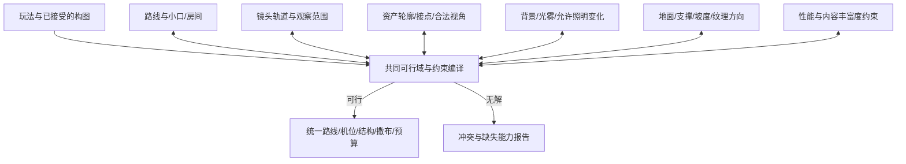

# 场景系统设计：空间、资产、镜头共同成立

版本：2026-09-22。状态：设计交付，待按开发需求实施；不是场景验收报告。

## 1. 产品方向与视觉语言

产品不是写实三维迷宫，也不是一张背景图向前缩放。目标是 **有真实位移和前后关系的绘本舞台**：三维角色、路线和战斗保持空间可信；手绘薄片、少量简化体块、分层景深构成环境；构图可以刻意压缩透视，但世界中的脚点、遮挡、移动和攻击关系一致。

场景提供四项体验：前进的期待、窄口与展开的节奏、选择的可读性、战斗的清楚。微恐怖来自熟悉事物中的异常：住宅太长、家具组合少一个使用者、镜中多一扇门、鲸腹里有生活遗物。不是每平方米都塞怪异图案，也不是每个物体都发光。

统一风格规则：

| 维度 | 全作保持 | 允许按主题变化 | 应拒绝 |
|---|---|---|---|
| 形体 | 可读的大轮廓、明确根部/支点、少量中等细节 | 岩石层理、木作秩序、器官曲线、人工几何 | 所有类型都画成对称完整门框 |
| 线与纹理 | 同一观察尺度下相容的线密度和笔触 | 石/木/布/肉体的材料差异 | 同尺寸资产一张粗黑线、一张摄影写实 |
| 明度 | 近侧框景、中景结构、远方目标具有可辨层次；角色与交互优先 | 暗林、暖屋、冷洞、湿润腔室 | 全图同亮度；靠全屏压黑掩饰结构错误 |
| 色彩 | 大面积克制的材料色，少量有意义的强调色 | 每个主题独立主色与辅色 | 所有洞壁自带蓝晶、每根梁都挂灯 |
| 透视 | 原版已满意的角色画幅占比、地平线及离轴投影优先保留 | 行进镜头的受控平移/朝向；不同空间截面 | 为藏缝任意拉广角或放大人物 |
| 节奏 | 结构的重复建立空间，轮廓变体打散机械感，焦点负责记忆 | 生长、施工、侵蚀、仪式等组织规律 | 等距同款排队；随机杂物没有主次 |

**森林可继承的是成功机制，不是它的一切参数。** 其根、干、冠分工；大中小层次；不规则簇；近侧填充；稳定根点；空隙中的远景，这些可抽象。树密度、冠高、地形噪声、开放天空不能直接移植给厨房或山洞。

## 2. 已查明的问题与错误假设

本轮只读核对的代码包括 `route.gd`、`world3d/route_segment.gd`、`journey/local_route_spec.gd`、`journey/expedition_route.gd`、`journey_camera.gd`、`world3d/projection.gd`、`world3d/ground.gdshader` 及生态/布局代码。

| 当前事实/用户反馈 | 错误假设 | 本案的根本修正 |
|---|---|---|
| 岔路圆弧结束后继续保持约 ±0.5 弧度方向；地面也另写相似公式 | 选择左/右就应永久斜向前进 | 路线是有限过渡，末端切线必须属于下一段契约；所有系统读取同一条编译路线 |
| 镜头依据前方固定 75 单位路线朝向；平滑不等于限制视域 | 镜头提前看向支路中心总是正确 | 门口识别与转向分阶段，使用允许机位域、构图限制与速度限制 |
| 原地面方向主要使用世界坐标；局部路线不断偏转 | 有纹理即可，不必关心地砖与路线朝向 | 定向地面使用路线/房间坐标，岔口使用独立接合片 |
| 洞口、队伍行走、战斗站位、镜头包络曾共同拉大场地 | 一个通道宽度能够服务全部系统 | 拆成五种空间，分别约束并验证连接 |
| 整拱放大、半拱镜像产生拉伸/M 顶 | 单张跨度不够就缩放或镜像 | 使用有内轮廓、朝向域与连接语义的模块/组，先验证组合再铺场景 |
| 顶部 65 条射线只测上部区域 | 部分射线被挡住等于场景正确 | 分区检查、透明轮廓、连续路径与照明域共同验收 |
| 24 景的故事继承、物理空间与结构库混杂 | 来自矿洞故事的住宅也可用矿洞结构 | 故事主题、空间结构、路线语法、照明策略分离 |

旧紧凑山洞的高大顶面和扩展覆盖不是已认可的算法成果。它只能作为失败样本保留，不进入新规范默认值。

## 3. 五种空间，不再共用“宽度”

1. **可走空间 W**：角色脚部与行动碰撞的扫掠范围。
2. **战斗空间 B**：队伍列、前移极限、敌人接近、技能范围与清晰可视区。
3. **洞口/门口 P**：画面里理解为入口的孔径及实际通行喉部。
4. **镜头域 C**：相机位置、朝向、近裁剪面及关键视线允许到达的范围。
5. **装饰空间 D**：可承载侧岩、家具、悬挂物、冠层等的域，分地面支撑与空中悬挑。

约束包括 W 与实体支撑不相交、B 内不遮住必要交战信息、C 不穿过薄片背面、P 连通 W、D 的悬挑可覆盖 W 上方但不得低于净空。视觉资产的整张矩形不等于实体支撑体积。

小洞口不是把战斗队伍挤进同一个孔。默认流程：**行进队形收束 → 紧凑选择节点 → 小喉口 → 遮挡过渡 → 内部展开 → 战斗队形就位**。只有 B 与 C 已共同成立才能触发正式战斗。收束须使用已有或新增的真实角色行走逻辑，不允许瞬移穿门。

若保留固定宽队形不允许收束，就必须承认小门不可通过：改为更宽实际入口或改变该节点玩法。不能只把画面门洞画小而让角色穿石头。

## 4. 类型不是一棵按故事命名的继承树

每景由六个独立维度组成：

`空间子类型 × 路线语法 × 截面序列 × 主题材料包 × 照明闭合策略 × 功能/异常模块`

- 空间子类型决定重力、支撑、围合和结构重复方式。
- 路线语法决定沿路、节点、门口、转弯、后续方向。
- 截面序列决定宽/高随路程怎样收缩、展开，不意味着左右对称。
- 材料包只影响艺术与语义，不凭颜色改变地形和路线。
- 闭合策略决定哪些背景允许显露、哪些必须有结构。
- 功能模块包括营地、商店、事件、战斗；异常模块包括镜像、错尺、脉动等。

现有 24 景按 **6 大类、18 子类型** 分析，逐景方案见 [类型手册](SCENE-ATLAS.md)。18 是本案的结构分类数，不是宣称已有 18 个成熟算法；多个子类型共享通用求解器，但不能共享未经验证的视觉配方。

## 5. 路线语法与体验节奏

**2026-09-22 用户示意补充是本节的细化约束**：见 [通道与事件合同](ROUTE-EVENT-CONTRACT.md) 和 [13 张核心参考图](../references/CORE-REFERENCES.md)。R1 必须区分视觉边界、人物路线和镜头轨迹，支持错落凹室/柔和缓弯；R2/R4 区分有门遮挡和无门预览，并包含选中接管与未选退休。事件的必发/可能/无战斗能力先于布置确定，不能触发时临时清场。普通通道不继承整个战斗段宽度。

| 语法 | 适用 | 空间组织 | 关键禁止项 |
|---|---|---|---|
| R1 连续通道 | 林路、洞道、拱廊 | 主方向稳定，局部宽高有节奏 | 每个段落都放宽成广场 |
| R2 紧凑多入口 | 小洞穴、住宅门厅 | 入口在远端即可辨认；小节点分配选择；各入口独立喉部 | 取所有支路远端宽度并集作为整个节点宽度 |
| R3 绕障分流 | 森林、庭园、柱群 | 一至数个结构岛分隔路线；背后有局部合流或独立段落 | 路口中间整片清空 |
| R4 门—过道—房间 | 居室、作坊、鲸腹小孔 | 门洞小，越过门后才展开；房间有自己的坐标 | 门口就同时完整展现整个下一房间 |
| R5 通道—局部战斗袋 | 洞穴、高洞、沼泽 | 战斗区是被前后过渡包裹的展开段 | 每次走路都使用最宽战斗截面 |
| R6 横向台口/终点 | 剧院、商店、封闭入口 | 终点焦点与侧向进出模块，结束后进入明确出口 | 把背景门画在远处却没有可达路线 |
| R7 桥/栈道/平台 | 旧桥、钟楼、裂隙 | 步行面和外侧空域分离，承重/护边有逻辑 | 为填两侧把空域塞满树岩 |
| R8 不可能连接 | 兔子洞、镜廊、诡异档案室 | 只在门后完全遮挡或显式转场处换映射；保留邻接关系 | 在可见战斗/技能过程中扭曲空间或重置物体 |

### 岔路方向与地面连续

默认支路采用有限 S 形过渡：从当前前向进入侧门，过门后恢复与主推进轴平行的局部直路，允许保留横向偏移。**恢复方向不等于把角色搬回原来的中心线。** 若玩法需要真正转入另一个方向，下一段以新的固定前向接续，地面、结构、镜头全部继承该局部坐标；不得各自猜测。

路线可用五次 Hermite 曲线或受控 B 样条表达，以端点、切线与曲率条件定义。建立弧长查找表，使角色速度是沿弧长的速度，不是曲线参数速度。相邻段至少位置和切线连续；镜头与快跑使用曲率连续或有明确的缓冲段。

走廊由路线的横截面扫掠产生。曲率 κ 与半宽 w 应满足局部不折叠条件 `|κ|w < 1`，同时做全局自交与非相邻走廊碰撞检查；这个不等式本身不证明全局无交叉。转不过去就调整门向、路径或截面，不能把装饰拉长填上。

分岔区使用一个 junction 所有者，负责入口组合、分隔结构和接合地面。各支路仅从自己的 portal 后开始铺排，不在共同区域叠三套完整环。

节奏先定义事件序列 `预告 → 辨认 → 选择 → 穿口 → 展开 → 遭遇`，再按正常步速计算路径长度和可读时间。不能为了满足远端摆放而让角色加速，也不能因为窄口遮挡短暂就取消玩家选择时间。

## 6. 联合约束求解：不把问题推给最后一个环节

### 6.1 输入与变量

输入是子类型、内容节点、队伍通行包络、受保护投影、允许屏幕比例、照明变化范围、经审查的模块目录和性能档位。

变量包括路线控制点、截面曲线、门洞位置/方向、有限机位轨道参数、结构组的选择与刚体变换、少量合法的统一缩放、背景区域和照明档位。**纹理任意非均匀缩放、无限加物件、无限压暗不属于可用变量。**

### 6.2 硬约束、软目标与裁决顺序

硬约束：通行/战斗安全、空间连通、段落接续、相机与近裁剪安全、结构合法视角、必须闭合区覆盖、出口可辨、资产比例域、光照域有效、预算不超上限。

软目标：近中远层次、左右不机械对称、压迫/开阔节奏、主题焦点数量、局部自然生长、轮廓重样距离、平滑镜头、包体与实例成本。

采用 **先可行、再分级优化**：

1. 玩法与受保护构图成立。
2. 路线、门洞、相机和结构存在共同可行解。
3. 空间气质成立：洞穴紧凑，宫殿有秩序，高洞有高度参照。
4. 减少重复、补叙事组、优化资源。

不能用“美观总分更高”抵消穿模，不能用“帧率好”抵消少了顶部结构。软目标的权重只用于同一优先级内排序。

### 6.3 实际可实现的求解方式

使用**有限模板 + 约束传播 + 有界回溯 + 局部优化**，不用运行时全局黑盒搜索：

1. 从路线语法库选兼容节点模板，建立 W/B/P/C/D 初始域。
2. 剔除视角、尺寸、接口不兼容的结构组；传播通行、挂点、顶高与机位限制。
3. 对少量候选的门向/机位轨道/结构组组合做共同评估，先裁掉硬失败。
4. 可行后，用方向场与分层采样生成候选装饰；做预算与重复度优化。
5. 编译出固定布局、允许机位轨道、碰撞/遮挡代理、地面与区域数据。

设计初始工程上限：每节点最多评估 32 个完整候选、局部修复 2 轮。它是防止无限尝试的计算上限，不是艺术质量阈值；性能测量后可缩小。超限输出冲突集合与缺口，不自动放宽硬约束。

冲突报告示例：`小门净空要求 + 固定并排队形 + 当前相机横移范围` 无公共解。给出的选择应是收束队形、改变门口/机位模板或改用另一种节点，不能继续补岩石。

检查到的冲突集合不必宣称数学上的最小不可满足核；开发初版输出可以定位责任的近似最小集合即可。

## 7. 镜头和漏空：从许可域推导，而不是看一张补一张

### 7.1 机位状态

| 阶段 | 镜头职责 | 约束 |
|---|---|---|
| 普通行进 | 延续原版人物占比，维持远处目标 | 固定投影基准；轨道有速度、加速度上限 |
| 看到岔路 | 让入口可区分 | 入口屏幕位置/遮挡受限，镜头不急着对准支路 |
| 选择后接近 | 跟随队伍，保留框景 | 朝向随穿口进度渐变，可滞后于路线切线 |
| 穿口 | 避免看见薄片侧面与门后外空 | 窄机位域，近裁剪安全，转向经过允许视线走廊 |
| 内部展开 | 恢复远景与队形 | 出口已越过后才恢复正常前视方向 |
| 战斗 | 优先列、敌人、技能范围可读 | 使用单独稳定构图，禁止继续使用穿口镜头约束 |
| 战后离开 | 连续接回行进 | 人物占比、速度、地平线连续 |

正式游玩不开放自由旋转/缩放镜头；系统仍可在上述阶段轨道内做受控运动。先设计可看空间，再约束机位，不将玩家自由绕看纳入本模板。侧视不是必需能力，也没有统一的 15°默认上限；具体方案确需侧视时再验证。可借鉴视空间构图约束和 Director Volumes 的方法，把机位搜索缩成少量有意义的自由度；不需要照搬复杂研究系统。[Lino 作者研究说明](https://sites.google.com/site/christophelino/research)

### 7.2 投影、覆盖与近裁剪的联合计算

保留现有离轴投影。所有覆盖推导从实际投影矩阵反投影得到射线 `r(u,v)`，不能用通用 FOV 公式代替本作镜头。对平顶高度 H 与相机位置 c，向上射线的交点参数是 `t=(H-c.y)/r.y`；仅当 t 为正且在有效范围内才可能由该顶面覆盖。

**近水平射线需要无限远顶面，有限顶板不能解决。** 此时必须让该视线落到远端结构/合法背景，或改变该阶段允许机位。不得不断加大顶面直到“似乎挡住”。

覆盖不是只求射线与任意三角形相交：还要检查相交处 alpha 是否有效、材质是否在允许照明下露出边界、该面是否处于合格观察角、是否被近裁剪切开。

对镜头可移动域作 swept frustum（扫掠视锥）分析：先求结构可能暴露范围，再布置模块。相机本体未碰撞不代表近裁剪面没有进入岩片；要测试近面及核心视线束。

### 7.3 分区语义

每个模板提供屏幕区域随阶段变化的语义遮罩，不统一强制“上 30% 必须不透明”：

- 上方：冠层/顶层/允许天空，按子类型选。
- 左右：近景主体量感、侧路可读区与允许空域分别标注。
- 左上/右上：转向最容易暴露，独立记录覆盖余量与观察角。
- 中央远景：可见目标或深度背景，不把它与漏空混算。
- 角色、敌人、交互：明确的可读性保护域。

对封闭区域计算未覆盖连通域的位置、最大宽高、持续时间、正式照明下的对比度；不能只用总漏空像素比，因为小而高亮的角缝比大片低对比远景更刺眼。

### 7.4 连续保证的边界

无 alpha 的保守体可做几何包络证明；绘制轮廓使用离线低分辨率 ID/深度/alpha 渲染辅助检查，并在曲率、朝向或遮挡变化快的位置自适应加采样。若投影轮廓移动上界大于覆盖余量，继续细分；无法建立上界就标为抽样验证，不写“全程保证”。

实际分辨率与美术最终观感仍需一次完整回放，特别是透明边缘与动态雾。机器的职责是尽早拒绝结构不可能的方案，不是声称计算已经代替审美。

### 7.5 漏空修正的合法顺序

先判断这是允许背景还是错误缺口；错误缺口再定位共同约束：

1. 机位越界：修正机位状态/轨道，不移动整个世界追相机。
2. 模块观察角越界：调整模块组方向，必要时增加第二视角片/浅体块。
3. 某一语义槽位缺失：增加该槽位的适配模块，如右上转角岩肩。
4. 资产轮廓无合法组合：重制该轮廓或更换组，禁止无限缩放。
5. 空间模板本身无解：回到路线/门洞关系，拒绝当前模板。

不能擅自增加连续左右墙；侧边体块、柜体、岩体等只按各子类型定义使用。深色背景是明确的闭合策略，不是事后掩盖第 5 类问题。

## 8. 资产库的角色、组成与趋势

### 8.1 九种职责

| 角色 | 任务 | 典型资产 | 必须记录 |
|---|---|---|---|
| S0 基底 | 地面、需要时的顶面与远背景 | 可平铺材料、浅地形/顶壳 | 真实纹理周期、方向、边界、所属区域 |
| S1 路边主结构 | 定义通道轮廓与尺度 | 树干、岩柱、柱架、床柜组 | 支撑、占地、向通道悬挑的轮廓 |
| S2 近侧填充 | 少量建立左右实体量感 | 宽厚竖岩、冠干团、箱柜背组 | 前/侧可见角、宽高域、与 S1 的材质关系 |
| S3 顶部结构 | 顶弧、梁、冠层、肋膜 | 岩肩、顶岩、梁段、膜片 | 内轮廓、接合域、挂点、净空 |
| S4 接合/转折 | 根部、角部、岔口接口 | 岩根、柱脚、角梁、门侧组 | 可连接对象、遮缝范围，不得侵入通行 |
| S5 功能生活组 | 让地方有用途与记忆 | 炉灶角、工作台、营地、戏台道具 | 主从关系、使用方向、表面/插槽 |
| S6 附着与悬挂 | 打破截面重复、构造上部深度 | 灯、藤、链、布、钟乳、悬吊人形 | owner、挂点、扫掠包络、最低点 |
| S7 低层过渡 | 根脚、边缘与稀密衔接 | 草、木屑、碎石、灰烬、水渍 | 生境、支撑类型、可压入深度 |
| S8 焦点与物效 | 稀疏的叙事/导航强调 | 异常晶体、门灯、滴水、孢子 | 显著度、最小重现间隔、发光/粒子预算 |

不是每景必须九类全部有大量文件。例如开放石桥不需要顶结构，但桥面与桥侧接口要求更强。S2 是“侧向质量”的职责，不能在开放桥外造悬空假岩墙来满足数量。

### 8.2 独立图、组合、烘焙图如何选

- 经常改变组合/位置的元素独立：无光岩面、可选晶体、梁与吊灯、桌与陈设。
- 关系固定且总一起出现的细小元素可烘焙为组：小片碎石、落叶团、工具挂板。保留独立支撑语义，不为每粒石子建节点。
- 必须变化观察角的近景结构用两/三视角片或低面数浅体块；结构片不持续 billboard 追镜头。薄片只适用于声明的观察角锥。
- 组也有净空、轮廓、预算与重复签名；组通过后才允许大量实例化。
- 左右镜像可用于无方向低显著细节，不能默认视为新轮廓，更不能保证两半组合后内拱正确。

每资产至少有：有效 alpha 域、米制尺寸、根点/挂点、支撑接触区、实体足迹、可悬挑区、内侧轮廓、材质与显著度、合法方向/缩放域、连接插槽、风摆/刚体规则。图片自动分析能求 alpha 边界，**不能仅凭 alpha 推断哪片是地面支撑、是否为完整拱、是否该翻转**，这些需要一次语义标注。

### 8.3 山洞的特殊轮廓约束

洞壁采用层理一致的中等岩组为主，顶岩与侧岩交错接续，大完整拱仅用于少数稳定直段或地标。不能把“用碎块”理解为无方向随机石堆。

建立洞腔内边界：路侧从较低位置向上、向内收束；中心允许自然不对称，但不得出现因镜像导致的两个高点和中间机械下陷。组合检查提取内边界，区分设计钟乳局部凸出与贯穿整个截面的 M 型下降；不能用全局强制单峰抹掉天然岩洞变化。

左右同一深度不必成对；顶组可前后错位形成遮叠，错位由实际相机视域检验。主结构图不带明显发光点，稀疏晶体/菌光是 S8；这样才不会因加密结构同时加密灯光。

### 8.4 用“因果场”组织撒布

场包括：到通道边的距离、到支撑面的距离、结构方向、光照/湿度、风/水流方向、可见显著度、事件中心与生长年龄。它们驱动具体角色，而不是对所有物件施加同一噪声。

例：树根周围高概率低草，路中因踩踏降低；岩石沿层理组成错落块，碎屑更可能出现在坡脚；水渍沿低处汇聚；作坊杂物朝工作台靠拢；肉体膜沿肋架接续。所谓“趋势”是这种连续因果，不是多放同款。

结构先用形状/组合语法确定关系，装饰父簇再用可变半径排斥采样，簇内细物按条件分布生成。Poisson disk 只负责间距与防扎堆，不负责主题和故事；CGA 式层级拆分可借鉴到“空间—结构组—配物”。[Bridson 原文](https://www.cs.ubc.ca/~rbridson/docs/bridson-siggraph07-poissondisk.pdf)、[Müller 等原始论文](https://doi.org/10.1145/1179352.1141931)

## 9. 到底需要多少资产：先计算需求，再核算文件

### 9.1 必须分别报告的六个数字

1. 原始文件数；2. 有效独立轮廓数；3. 合法组合数；4. 同屏实例/显著重复数；5. 一段体验内的重现间隔；6. 新增制作量。

一个角色图换三种色不能算三个结构轮廓；十件小物拼十组也不能掩盖同一醒目主物重复。`新增量 = 需求集合 − 经检查可复用的能力集合`，不是需求总数减文件总数。

### 9.2 覆盖与数量模型

先按入口、行进、选择、穿口、内部展开、战斗、离场，以及允许机位/照明生成需求行。每行记录必须出现的角色、屏幕尺度、可见轮廓、连接类型和叙事功能。候选资产/组是列，记录能否以合法变换满足该行。

这是带连接、预算与重复约束的覆盖选择问题：选择满足所有必要需求的资产集合，最小化制作成本/包体/实例成本；**只能给出最低可行库，不能直接代表丰富度。** 再添加以下艺术下限：

- 同一显著轮廓在一个镜头中的最大重现次数。
- 沿一次实际旅程的最短重现间隔。
- 场景必须具备的功能组合与叙事锚点。
- 近中远层不同的轮廓/频率，以及允许安静区域。

若某角色在最拥挤镜头中需 n 个可辨实例、相同显著轮廓最多允许 r 次，则独立轮廓下限 `ceil(n/r)`；若在记忆窗口 T 内需要 k 次不同出现，则实际下限还要满足时间复用约束。T、r 不能全场景统一设：显眼灯笼/完整雕像与普通碎石明显不同。

具体值应来自设计的节点数、路径长度、速度及一次清楚的组合审查；未测量前标为待测，不能自动填“6 张足够”。低显著模块可重复更多次，稀有故事物常常只需一张但只能出现一次。

### 9.3 可复核的算例，不是现有洞穴已测配额

假设一个洞穴模板最坏镜头同时看到 6 个明显侧岩组，允许同一主轮廓最多出现 2 次，则至少 3 种**兼容当前左右/角度需求**的侧岩主轮廓。若其中 2 个位置需侧视而这三张均只适合正视，数量够仍不合格，必须补对应视角能力。

再假设当前连续段需 3 个可辨顶部组、每组由“肩部+顶岩”组成，顶岩相同重复上限为 1，则至少需要 3 种顶岩轮廓，或经组级观察确认确实不同的组合；把同一尖晶体左右翻转不能顶替。

倘若一次旅程还要有营地、渗水节点、古老封门这三种叙事功能，结构数量满足也未完成。需要三个有身份的功能组，而不是再加十块岩石。功能组中的碎石、绳、旧木可复用；独特封门不随处复用。

因此本案不编造“每景必须 30/50/80 张”的表。正式制作清单应列到 `槽位→需要的兼容轮廓→现有可用→缺口→提示词→验收条件`，并可追溯到哪个镜头/节点需要它。若没有测得需求矩阵，只能预算，不能批准批量生图。

### 9.4 丰富度的判定

丰富度至少由 **形体层次、空间变化、功能叙事、材料差异、疏密节奏、光效层次** 六项判断。大图数量多、地面铺满、粒子多都不能单独判合格。

统计轮廓复用、最近重复间隔、局部图像自相关、各层显著度能发现机械重复，但不能把熵越高当越好；白噪声最丰富却最没设计。必须有结构秩序和安静区。

## 10. 顶、角、地面、光雾是一套材料与空间契约

### 顶部四种闭合策略

| 策略 | 允许 | 适用 | 失败条件 |
|---|---|---|---|
| open | 明确天空/远空 | 森林、庭园、街道、桥 | 把天空误填成天花板；树冠突然断片 |
| atmospheric | 深色背景、远雾衔接层叠结构 | 暗洞、高洞、部分鲸腹 | 允许的灯光/技能使轮廓接缝高亮暴露 |
| hybrid | 近处实体/层叠顶，远处渐入背景 | 大多数洞道、剧院高顶、拱廊 | 近角靠黑色透明片挡，转头能看穿 |
| geometric | 明确连续材料或浅壳 | 较亮低室内、部分工程拱道 | 顶材质错位、薄片背面暴露、边缘与光照不一致 |

顶部可以由岩肩、梁、冠层、肋架、悬挂物组织，**不强制所有洞顶一张连续天花板**。挂饰负责节奏和空间参照，不负责遮住所有本该封闭的洞。

### 背景与光照

场景配置低频背景的上/中/远端颜色和亮度，来源于该主题材料及正式光照，不自动套纯黑。封闭空间可用暗色远景罩；开放空间保留天空纵向渐变。背景贴近结构明度是衔接手段，但不能消除必要的局部明暗与体积。

每景冻结三组同机位结果：中性明亮无雾用于定位、正式光照用于艺术判断、游戏允许的最不利照明用于稳定性判断。最不利照明应枚举真正允许的灯/技能组合或从其亮度上界推导，不能杜撰一个永远不会出现的全白照明再要求彻底封闭。

独立光源资产优先使用发光表面、受控局部染色/投光贴花、少量有预算的实际灯。它们不是物理灯的完全等价替代，必须规定受影响对象、距离衰减、累计亮度与遮挡限制。不能让隔墙火把照穿所有物体，也不能将灯的明亮部分烘焙进每块结构。

### 雾与物效

保留用户喜欢的弯曲雾形。雾层按世界深度、场景段落和用途归属，和角色之间做深度感知的软交接；不能通过固定绘制最前层覆盖角色。交叉薄片、透明排序与软粒子需要在项目实际渲染器上确认，不能承诺一条 shader 适配全部情况。

薄片结构优先 alpha cutout 或经过评估的覆盖方案；雾保留必要 alpha blend，限制重叠屏幕面积。Godot 官方说明透明物体排序存在对象级限制，调整优先级并不能普遍解决相交透明面。[Godot 渲染限制](https://docs.godotengine.org/en/stable/tutorials/3d/3d_rendering_limitations.html)

灯、滴水、灰尘、风、肉体脉动各有来源与区域：滴水落到实面停止；树根不跟树梢同幅摆；肋骨不随软膜变形；吊具以顶点摆动而非以地面脚点旋转。悬吊人形是明确主题选择，排除战斗索敌和单位阻挡。

### 地面与接地

地面分自然软表面、刚性铺装、局部平台和液面。森林原有起伏不能复制进厨房、镜廊或需要定向排水的下水道。

刚性家具用多个支撑点拟合局部支撑平面，检测残差；超限优先换位置/局部基础，不让四条腿分别沉下去。草根/碎屑允许声明的小幅埋入；根部 alpha 不能自动当作真实触地点。

路面定向纹理使用 `(s,d)` 弧长—横向坐标，房间用房间局部轴；分岔处存在坐标多解，使用独立 junction 地面片和过渡带，不能硬取最近支路导致地砖闪跳。自然无方向材料可保留世界投影。

地面坡度上限取以下约束的最小可行值：角色步态/脚底接触容忍、刚性资产支撑、相机地平线体验、水流逻辑。各类型具体上限必须由选定资产和动作测得，禁止用同一“8°”代表全作已验证。

## 11. 高级算法的用途与成本边界

| 方法 | 解决什么 | 放在哪里 | 不负责什么 |
|---|---|---|---|
| 类型化空间/形状语法 | 房间、通道、结构组的合法组合 | 离线/加载编译 | 不自动产生好看的资产 |
| 约束传播与有界回溯 | 路线、机位、门洞、结构冲突 | 编译阶段 | 不无穷搜索“总会成功” |
| 弧长曲线、局部标架、扫掠体 | 速度、转向、净空和地面统一 | 编译后运行时查表 | 不决定故事节奏 |
| 相机允许域与屏幕构图约束 | 过门不露侧、人物不忽大忽小 | 模板编译；运行时平滑跟随 | 不修复任意图片视角 |
| 分层条件场、簇采样、空间哈希 | 有原因的疏密与低成本避让 | 分段确定性生成 | 不把随机密度当氛围 |
| 语义轮廓与图像/深度检查 | M 顶、支撑、透明缺口、重复 | 资产/组检查和编译工具 | 不替代最终艺术判断 |
| 区域/Portal 可见性与实例分桶 | 流式加载、减少无效渲染 | 运行时 | 不对大量透明整屏过绘免费 |

场景不会在每帧进行全图覆盖优化或逐像素修补。静态结构预编译、确定性复用；小物按材质和空间块合批；实例按距离/可见范围降级，保留大轮廓，移除低显著小物。Godot MultiMesh 适合实例批绘，但没有逐实例视锥剔除，应按空间域分块而非全景一个批次。[Godot MultiMesh 文档](https://docs.godotengine.org/en/stable/tutorials/performance/using_multimesh.html)

性能要求以目标机器、分辨率、渲染后端、镜头域和压力场景声明。60 FPS 是 16.67ms 的帧预算；CPU/GPU 通常重叠，不能把两者耗时简单相加分配。当前旧旅行样本不能证明 50 怪物加技能的预算。环境应设置可控的顶层级、雾过绘、动态挂物、实时灯和上传峰值预算，具体数由一次定向压力分析确定，不反复全量巡检 24 景。

## 12. 从设计到可生产：一次解决一类约束，不逐景救火

流程是：类型/体验说明 → 路线与机位共同灰模 → 需求矩阵与资产盘点 → 单资产与组合检查 → 最小代表段编译 → 正式光照/允许亮光回放 → 冻结类型模板 → 按主题换内容 → 增量验收。

最小代表段必须同时包含该类型困难点：普通段、2/3 入口、左右穿口、进入后展开、战斗与下一段连接。不能只做一张漂亮正面图就称标杆。

首轮应优先解决跨类型共同根因：有限岔路、机位域、顶角检查、资产观察角和需求计算。之后用紧凑洞穴、低顶室内、高洞/拱道代表组验证差异；鲸腹、剧院、桥与镜廊再各自验证不可继承部分。森林保留为视觉及构图回归参照。

**避免无限返工的关键不是宣称方案永远不失败，而是让失败发生在低成本阶段，并能指出哪个约束无解。** 已冻结的类型只能在声明域内扩展；超出域就新增模板/资产能力，不能偷偷放宽或修改全局规则。
