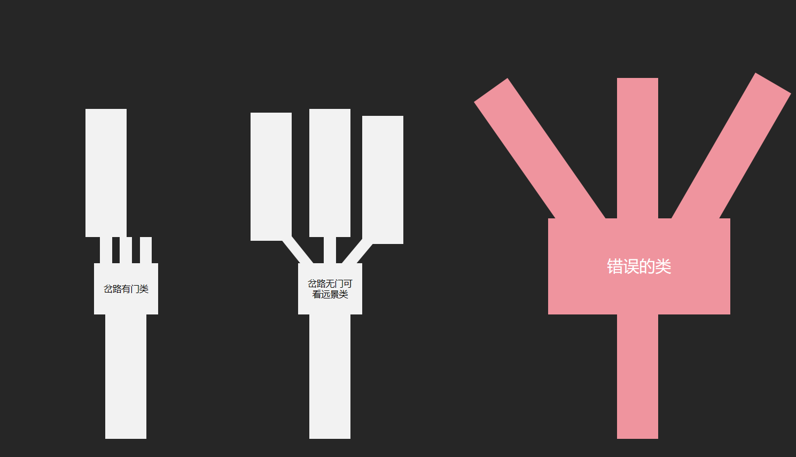
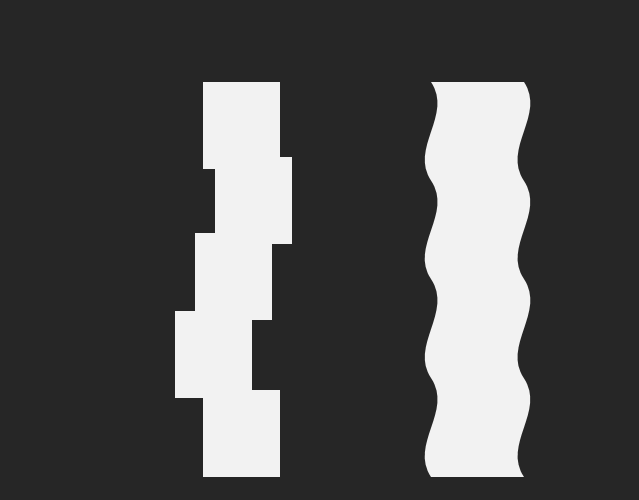

# 核心参考：通道、岔路、事件与场景层次

版本：2026-09-22。此文档为长期统一参考入口，收录 **13 张原图：用户空间示意 2 张＋此前参考游戏截图 11 张**。图片已复制到工程，不依赖临时剪贴板路径。用户示意规定目标组织关系；游戏截图仅用于学习视觉方法，不证明其内部算法。

**当前先读：[本地视频复核](VIDEO-ANALYSIS.md)，再读[逐图分析与实施边界](REFERENCE-ANALYSIS.md)。** 用户提供的原视频已登记，并提供[带时间定位的复核页](video-study/index.html)。视频分析明确区分连续运动、剪辑跳转与内部实现未知项。下方短图注只是索引，不作为已验证的执行规范。C1 的早期拆散柱顶和整拱重复试验均未通过；2026-09-23 已恢复隔离的 2D 主导研究，当前证据与剩余问题见 [2D 岔路试验](../design-v2/2D-FORK-VISIBILITY.md)，仍未美术验收，不改正式场景。

所有原图保持原样。来源文件、尺寸与 SHA-256 见 [manifest.json](manifest.json)。算法落实见 [通道与事件合同](../design-v2/ROUTE-EVENT-CONTRACT.md)；资产失败与准入见 [C1 检查](../design-v2/C1-ASSET-QUALIFICATION.md)。文档归档不代表场景已经实现或验收。

用户确认的解释边界：正式镜头不允许玩家自由旋转/缩放；战斗不得在任意行进位置发生，须使用预备好的事件区域；不要求侧视，15°只是必要时应有限制的举例，不能作为通用设计参数。

## 用户示意 A：紧凑岔路与稳定主轴

- 左：有门/可靠遮挡，小选择区只展示入口。选中内容准备好后随开门显露，互斥后续可以复用重叠空间；不能同时启用多套重叠世界。
- 中：无门/能看远景，显示入口和有限纵深，侧口短暂偏转后恢复主轴方向。进入选中通道后，未选预览在不再可见时移除。
- 右：红色为用户明确否定的通用组织方式：宽广场接永久发散长通道。
- 恢复轴向允许保持横向偏移，不强迫角色回到原世界中线。人物路线、镜头和可見空间共同约束，不能只改变转弯公式。

## 用户示意 B：单通道内部也要有变化

- 左：边界局部凹入/凸出、左右退台和宽窄变化。可以形成岩窝、单侧功能凹室或家具退让；无需让人物跟着每个凹凸走折线。
- 右：连续缓弯和轮廓变化，以局部遮挡、视差和逐渐显露丰富行进；整体主轴稳定，不按固定周期无限蛇形摆动。
- 图不是米制施工图，也不要求新增连续侧墙；实际边界用各场景合法资产/组表达。
- 先确定事件能力再布置：必发战斗和可能战斗提前准备直道/展开/镜头；纯购买、升级、剧情可使用凹室或缓弯，但仍需可达、可读和合格资产视角。

## 参考游戏原始图册（11 张）

来源：[用户提供的哔哩哔哩视频](https://www.bilibili.com/video/BV15dY16MEaE/)。保留原界面及用户箭头。学习近中远组织、顶部层叠、附着关系和紧凑入口；不临摹配色、原作资产或第一人称角色比例。

### 图1 · 木架通道

人工柱梁有意重复，柱间岩土填充不规则；火把依附支撑向内伸出。这种结构节拍适合木撑矿道，不能直接移植成天然洞的重复石门框。

### 图2 · 根系开口

两侧厚实根系形成包围，中上部留出安静背景；不能凭静帧认定背景就是天空。该开放组织应声明为独立类型，不能成为封闭洞漏空的免责依据。

### 图3 · 远景选择入口

近框、中景根团与远端小入口形成嵌套；选择焦点集中，近通道没有成为多个完整战场的并集。红箭头是用户标注，入口后的真实路线不能由截图推定。

### 图4 · 接近选择节点

粗枝从近侧根体伸入，形成有附着关系的遮挡；较小枝刺延续到地面。实施应记录挂点、伸出方向与显露责任，不是随机添加横向装饰。

### 图5 · 休整节点

功能节点保留可见的侧面包围和后端门组；事件叠字遮住大量画面，不能据此量出地面密度或战斗净空。

### 图6 · 开启的侧口

右侧深色开口示意门后显露的组织机会；“门板确实遮挡且内部就绪”才允许接管，黑色画面本身不是安全切换的证明。

### 图7 · 商店组合

顶梁提供链条挂点，柜台划分前后，挂货围绕服务功能组织；需要完整功能组、焦点视线和悬挂净空，不能用随机小道具代替。

### 图8 · 双入口与梁架

双门集中在末端，前方仍是一条通道。此结论针对有门终端；多个物理分开的无门口仍须通过错位和显露设计解决空间需求。

### 图9 · 天然岩洞

核心是空出的洞腔：侧面连向内收的肩部，主拱中央抬高，局部钟乳才向下突出。资产必须先满足这条内缘，再通过前后错落消除机械重复；独立石柱加凸底顶板不满足。

### 图10 · 三入口与光色

三处暖色入口成为青绿环境中的功能焦点；高频结构与稀疏发光件应分开生产。原图不能证明动态点光数量或门后场景是否同时存在。

### 图11 · 开放顶部

可见构图由粗大近柱、根脚组合、中远柱序列和远端亮点建立，顶部暗区开放。归为开顶遗迹，不与图 9 的封闭岩洞共用顶部验收条件。

## 使用与检查顺序

1. 先看两张用户示意，确定通道组织、岔路显示方式和事件后果。
2. 对照原图学习近侧填充、纵深、顶部、功能组；按本作第三人称镜头重算，而非照搬画面宽度。
3. 明确单资产及组合的支撑、观察角、重复能力后才编译撒布；自然地、建筑和活体空间分别使用各自材料/连接规则。
4. 先用明亮诊断定位，再用正式灯雾及允许的亮光验看。允许的暗背景衔接与必须结构遮挡的区域分别判定。
5. 在完整进出过程里检查，不用一张入口图推定所有转入、事件及战斗均通过。
6. 新参考保留原图、来源和解释，追加到此入口及 manifest；参考裁决以用户明确要求为先。
