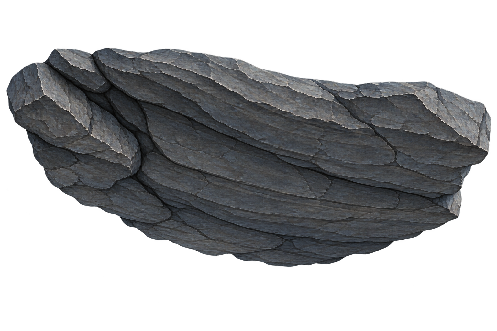

# 从参考画面到可生产的通道：逐图分析与实施边界

2026-09-22。**本轮只分析、修订设计。C1 山洞仍失败，停止继续铺排；本文不是已实现或已验收报告。**

原图和来源统一保存在 [核心参考图册](CORE-REFERENCES.md)，共 11 张游戏画面和 2 张用户示意。本文是静帧判读；后续已收到本地视频，运动证据、剪辑边界与修正见[视频复核](VIDEO-ANALYSIS.md)。两份文档均不声称已经还原源游戏内部算法。

阅读标记：**观察**是画面可以直接支持的事实；**设计转译**是本项目拟采用的实现，不是原作技术揭秘；**待验证**不得被后续执行者改写为完成结论。本文补充并修正旧文档中过于宽泛的“分层、随机、补顶”等措辞。路线产品边界仍见 [通道与事件合同](../design-v2/ROUTE-EVENT-CONTRACT.md)。

## 1. 首先纠正：要组织的是洞腔，不是石头数量

图 9 最重要的主体是岩石之间**连续空出来的通道**。其两侧向上逐渐收拢，主拱中央抬高；近、中、远的开口相互嵌套。局部钟乳下垂，但没有替代主拱的高低关系。这里的“圆”是包围趋势，不要求标准圆、左右对称或每隔一段一个完整圆环。

当前失败图中，可见独立竖立的石柱、架在上面的厚板、侧面和远处的灰色露空。增加石柱数量可以减少灰洞，却不能让柱廊自动成为天然岩洞。上一个重复整拱方案有洞腔趋势但机械重复；本次拆散后连洞腔趋势也失去。**保留共同洞腔、打破具体岩块的重复，两件事必须同时成立。**

这张候选整体下缘向中央凸出、中央最低。它可以候选为局部悬岩，却不能仅因“宽、像石头、可放头顶”就作为主拱收口。参考所需的是主开口中央较高、肩部较低；二者的轮廓作用相反。不是禁止凸块，而是不能用凸块的外形替代洞腔的内缘。

还必须区分：上方图片显示的背景颜色不直接证明其 alpha 合格或不合格；这次否定的是内容、内缘和用途匹配，透明处理须另检。

## 2. 逐图分析：具体学什么、不能推出什么

### 图 1：矿木架通道——有意重复的骨架，非重复的填充

[原图 1](mushroom-corridor/01.png)

**观察：**近侧木柱和岩土裁出左右边界；横梁沿深度接连出现，提供稳定顶高参照；柱间被粗糙岩土、根系占据。火把依附竖向支撑向内伸出，位置有结构理由。地面横向纹理向远处压缩，与上方梁列共同说明纵深。

**设计转译：**将“柱—梁”定义为可重复的人工支撑组，连接点和承托关系固定；每跨之间的岩土轮廓、塌落和小物可变化。梁距先满足结构节奏与投影视觉，再调局部缺损；不要对每根梁独立随机高度制造不合理支撑。

**当前误用：**天然洞中照搬这种等间距骨架，会产生矿井或殿堂感。不能据此为天然岩洞的整拱排队辩护；也不能反过来禁止所有场景的周期重复。

### 图 2：根系包围、中央松开的空间——开放区域须有语义

[原图 2](mushroom-corridor/02.png)

**观察：**左右近侧根系厚重，枝根伸向上方与中央；中上部是较安静的棕色区域，闭合程度明显弱于图 9。地面仍有堆积和横向层次。静帧不能确定棕色区域到底是雾、深处表面还是天空。

**设计转译：**允许“根洞过渡／开敞根谷”子类型把中上部声明为气氛背景区，外圈仍保持近侧包围。轮廓断开必须表达空间开敞，背景色、远层、正式光照共同维持这种解释。

**不能推出：**任何封闭岩洞的左右上角都能留空，再统一刷黑。是否可空是空间类型和照明能力的合同，不是填充失败后的补救说法。

### 图 3：远处选择点——多入口没有接管整个画幅

[原图 3](mushroom-corridor/03.png)

**观察：**最外层的大根与残垣裁切出近框；更细的中景根团在内侧重叠；小而集中的暖色入口标记在深处。眼睛先通过连续包围的通道，再找到选择点。红箭头是用户标注，不是美术内容。

**设计转译：**把选择提示、入口可见性、实际可通行宽度分开。远处可同时读出多个选项，不要求近处已展开多个战斗通道。入口可沿纵深错位；分隔体和肩顶组维持每个口的边界。投影检查入口能否辨认、能否进入及是否互相遮完，不只检查入口间世界坐标距离。

**不能推出：**图上几处门或亮点等于几条真实同时延伸的长路。源游戏的路线机制未知；本项目的有门／无门行为以用户示意为准。

### 图 4：接近节点——伸出的结构承担过渡

[原图 4](mushroom-corridor/04.png)

**观察：**左右粗枝从侧面结构伸入画幅，前后遮挡清晰；较小枝刺散落在地表，远端门组是集中焦点。伸出物不是漂浮的孤立贴片，能读出所属根体。

**设计转译：**“伸出装饰”应是带附着点、伸出方向、最低点和遮挡责任的组成员。它可以遮住结构连接缝，也可以使远景逐渐显露；不能遮住人物操作区或把入口封死。沿同一裂缝／根脉选择方向，禁止所有枝条等长等角横插。

**待验证：**不能仅凭图 3、4 两张构图相似的图片，宣称已复原其连续接近路径。我们的接近过程必须独立设计与检查。

### 图 5：休整——功能发生在既有空间里

[原图 5](mushroom-corridor/05.png)

**观察：**侧面根系和后端门组仍在，事件大字和卡牌遮住大量中、下画面。没有足够证据从本图量出空地比例、人物净空或完整地面组织。

**设计转译：**事件更换交互状态与焦点，不应自动清除前景结构或把通道拓成广场。纯休整可以沿用紧凑空间；有交战后果的事件必须事前准备战斗域，不能从“休整”字样推导无需战斗能力。

### 图 6：开门后的黑色侧口——遮挡是转换条件

[原图 6](mushroom-corridor/06.png)

**观察：**右侧出现深色开口，其旁仍有其他门和侧面根系；开口里的细节不清楚。

**设计转译：**有门型可在门板确实遮住后方时准备所选内部；开门前选中内容必须就绪，门口地面与后续路径接得上。未选分支不必运行完整世界。开门后玩家已经看得到的位置，不能再借“逻辑重叠”直接替换。

**不能推出：**一个黑洞足以遮挡任何切换，或原作必定用了门户渲染。是否遮住，需按本作眼点和门缝实际验证。

### 图 7：商店——顶部、悬挂物与用途是一个组合

[原图 7](mushroom-corridor/07.png)

**观察：**横梁形成低而密的顶层；链条挂物挂在梁下；柜台把前后空间分开；店员位于柜台后。右侧近火把和岩肩强化近框。挂货的密度围绕柜台功能组织，中央仍能认出服务对象。

**设计转译：**商店以完整功能组交付：柜台、人员占位、服务侧、顶梁挂点、挂货许可区、招牌／光源位。先保证交互焦点，再填挂件；不是先铺随机吊灯再把柜台塞进去。挂物最低点既要避开头部和武器，也要避开相机到店员的视线。

**类型区别：**低顶室内可使用平梁／平顶；该图不能成为天然洞平板顶的依据。悬挂者、吊灯、钟乳、货物可共享“挂点—摆动包络—净空”检查，但材质、尺度、功能和叙事频率不同。

### 图 8：双门节点——终端门组不等于双倍走廊

[原图 8](mushroom-corridor/08.png)

**观察：**两扇门集中在后端结构上，近处仍由木架、岩土围成一个通道。门组的顶梁与侧面支撑有可读关系。

**设计转译：**有门型可以共用前方单通道与选择区，按门扇、可达路线和提示的需求排门。门后互斥内容不参与前方通道宽度相加。

**修正旧结论：**“入口数增加不等于加宽”只适用于具体组织。三个同时可见且物理分开的无门口确实需要横向或纵向空间；应通过错位入口、短口和视线组织控制扩张，不能用同一句话抹掉几何约束。终端门组也不是擅自增加连续左右墙的授权。

### 图 9：天然洞——形状、岩层、细节有三个尺度

[原图 9](mushroom-corridor/09.png)

**大尺度观察：**左右实体一直连向上方，围出不规则圆拱。近层裁出画框，中层继续缩小洞腔，远处小开口与蓝色效果提供焦点。不是“所有东西等距排在道路旁”。

**中尺度观察：**岩层起伏沿包围方向变化，侧脚有堆积，肩部转向顶。局部内凸与凹窝打断圆拱的完美对称，但不破坏整体收拢关系。

**小尺度观察：**钟乳长度和位置不齐，较长垂落主要出现在局部；线纹、短尖角和碎石提供材质，不能替代主形。参考的连贯手绘纹理与当前候选强烈的独立亮顶面，会产生不同空间阅读。

**设计转译：**先定洞腔内缘，再选能表达对应弧段的岩肩、冠部、侧脚；局部悬岩只占许可的内凸区。完整拱图仍可以做有限直道或地标，不能横向拉开去包住所有岔口；零碎图只有拼出一致内缘才合格。轮廓方向错误的资产要换角色或重制，不能靠增加密度过关。

**不能测出的参数：**参考第一人称构图和卡牌遮挡不提供本作第三人称的米制洞宽、洞高、FOV、每米实例数。比例目标须用本作已接受的人物构图重算，不能照抄参考画幅占比。

### 图 10：三门与光色——焦点集中，光源不重复烘焙

[原图 10](mushroom-corridor/10.png)

**观察：**绿青环境中，三处暖色门标记成为集中焦点；两侧近框较重，根／珊瑚状结构在上方包围。亮点有功能含义，与所有承重结构一同反复出现的“发光石纹”不同。

**设计转译：**普通结构保持无强亮点的基础版本；少量发光组件绑定入口、裂隙、事件或生态条件。材质发光、假光斑、局部色场和真实灯分开预算，首先用无需实时点光的方式表达可见亮点；需要照亮角色／遮挡交互的灯才进入动态光源预算。

**不能推出：**原作真实点光数量或实现方式；三个门也不证明三个内部通道同时完整存在。

### 图 11：开顶遗迹——一种独立类型，不能拿来修补封闭洞

[原图 11](mushroom-corridor/11.png)

**观察：**巨大近柱截出左右画框，柱脚有骨骸、根与碎物，中远柱逐渐变小，远端竖向亮点建立目标。上部存在大块暗背景，没有图 9 那种连续拱顶。

**设计转译：**该类型的空间识别由“立柱序列＋有重量的根脚＋远焦点＋连续地面”承担。其顶部可开放，柱间背景有深度和色调要求。把它命名为开顶遗迹，便于与高洞、封闭殿堂分开生产和检测。

**不能推出：**封闭洞穴只要背景足够黑就无需肩顶关系。类型验收条件不得互借。

## 3. 两张用户示意规定了什么

### 3.1 有门与无门的岔路，必须各有一套显露过程

[用户岔路示意](user-route-diagrams/junction-types.png)

- **有门：**先是一个紧凑通道和可选择的门口；门遮住后续，选中后准备一套内部。允许内部逻辑空间复用，不允许同时看到互相穿插的几套内容，也不允许人物可见瞬移。
- **无门：**各口有可信的初段纵深；侧口短暂横向转接后恢复原前向轴，允许保留横向偏移。选择时仍看得见的其他通道保留；确实离开视野或被合法结构挡住后才回收。
- **明确排除：**将多个完整战斗通道取并集，再在巨大空广场周围补岩石。入口视觉分离、玩家穿口、战斗展开，发生在不同位置和阶段。

对无门型，鼻端、入口肩顶、进入后显露的回折面要作为一组考虑。单独一根缩小的高石柱，不自动具备分隔两条洞道的能力。若在允许镜头和小选择区下无法同时维持入口可读、通行和遮挡，就报告该入口组织无解；不能继续拉图、抬顶、扩大广场直到“勉强看得到”。

### 3.2 单通道：边界的变化不等于路线和镜头都摇摆

[用户单通道示意](user-route-diagrams/single-corridor-types.png)

左图是边界错落，可有侧窝、局部挤压、较宽停驻点；角色仍可能走直线。右图可以有缓弯和逐渐显露，但出口仍恢复整体轴向。不能把图中的波形直接做成等周期正弦路。

需要共享空间信息、分别生成的对象是：洞腔内缘、角色轨迹、镜头轨迹、地面纹理方向。边界凹进去不要求镜头看进去；走侧口不要求在穿口前就将镜头正对支路；控制镜头也不能让角色移到画幅边缘来隐藏问题。

事件能力先决定局部形状：必战／可能战斗在触发之前完成直道、队伍展开与机位准备；纯购买／升级／剧情可位于凹室或轻弯。具体保留域来自现有战斗列阵、前移、武器、敌人和相机，而非截图里的敌人数或随意给定的洞宽。

## 4. 把上述阅读变成能执行的模型

### 4.1 隐形洞腔导向，不是新增连续侧墙

为每段路线记录 `s`（实际路程）、横向中心、地面高度、左右净宽、肩部高度、顶部高度和不对称形状。用少量语义控制点构成内缘样条：左脚 → 左侧 → 左肩 → 冠部 → 右肩 → 右侧 → 右脚。它是**不渲染的设计导向**；可见内容仍由合法 2D 资产和固定组组成。

洞腔导向负责低频包围形状。岩层组负责中频趋势，碎块／钟乳负责局部变化。允许导向不是标准椭圆，但天然紧凑洞在一个主要腔体内，冠部总体高于肩部，肩部总体向内转，不能不经声明突然变成垂直立柱接平顶。岔口则是多个局部洞口及其连接，不能用一个大椭圆包住全部选择。

沿路线的变化采用有限趋势段，例如“偏左凹窝 → 回收 → 右肩较低 → 安静直段”；接口位置和变化速度连续。长度、幅度、宽高由角色／镜头／资产可行域决定。**不在此编造通用米数或实例间距。**

圆拱趋势检查必须针对导向与组的低频内缘，而不是对有钟乳的每个像素做单调性测试。把钟乳等局部内凸标为独立角色，避免把合理尖刺误判为主拱塌陷。

### 4.2 资产不是只有包围盒：内缘与连接带必须标注

每个结构候选需交付以下数据；先人工理解内容，再用图像工具提取和检查，禁止让 alpha 自动猜用途。

| 字段 | 具体内容 | 缺失时的处理 |
|---|---|---|
| `role` 与角色白名单 | 外围填充、侧脚、侧身、肩转折、冠部、局部悬岩、分隔鼻端、回折面等 | 禁止直接进入撒布库 |
| `inner_edge` | 朝向通道空腔的轮廓折线及方向；与外侧裁切边明确分开 | 无法证明该图能表达目标弧段 |
| `join_bands` | 可被邻件遮住的实体带、两端连接方向、遮叠前后关系 | 不允许只靠 bbox 相交称接好了 |
| `support` | 落地脚沿或悬挂点；依附对象、相对变换和最低点 | 禁止用同一个 bottom-center 锚点处理全部角色 |
| `opaque_core` | 考虑透明边缘后的保守实体区域；孔洞与边缘容差单列 | 覆盖检查不得把半透明光晕算成实心岩石 |
| `view_capability` | 源图绘制视角、已验证的近远距离／机位、画内光方向 | 未验证写未知，不给所有图填同一个 15° |
| `feature_family` | 轮廓家族、岩层方向、强识别亮面／尖齿／裂纹标记 | 翻转和换色不算新家族 |
| `provenance` | 原图哈希、标注版本、尺寸许可与审核结论 | 原图替换后旧标注失效 |

生产提示词也必须对应角色。结构弧段要描述“从洞内看、面向通道的凹形内缘、外侧连接延伸、接口藏在岩缝”；只写“独立透明背景岩石、完整物体”容易得到孤立凸石／柱子。外侧允许为后续拼组预留遮叠裁切带，但成品不得在可见处露出矩形剪切边。

**角色级退回举例：**当前顶石候选可以进入“局部悬岩待检”，不能进入“主拱冠部已通过”；强亮顶面的独立竖石可作局部巨石，不等于近侧连续洞体；岔路分隔组缺少进入后可见的回折面，则整个组不准入。不要因已经生成而降低准入标准。

### 4.3 拼组先服从洞腔，错位只在合法余量内发生

拟实现顺序：

1. 固定事件保留域、候选路线与镜头许可域，从中求得洞腔形状可行范围。
2. 从资产库选择内缘方向匹配的弧段，等比缩放、固定摆放，匹配连接方向与实体重叠带。左右可不对称，但要共享同一个腔体。
3. 沿纵深错开部分弧段，打断完整门框节拍；每次错开后重算视差下连接是否还成立。侧与顶不能各自随机完就直接合并。
4. 根部先解实际地面支撑；依附的肩、顶按组重新推导。若接地改变后无法保持接口，换候选组或报冲突，不能只把根落下而让肩顶悬空。
5. 再放局部钟乳、渗水、根须及碎石，条件来自挂点、裂缝、湿区、岩脚；最后放少量独立发光件。

资产朝向固定在世界中。避免侧视优先通过机位、路线和组能力联合设计；不得让承重结构随相机每帧转动，也不得拉宽贴片补偿压扁。

### 4.4 为什么现在的随机算法仍然机械

本次读到的 [cave_c1.gd](../../godot/scripts/spaces/layouts/cave_c1.gd) 中，侧图以两种轮换，高度以四个值循环；肩部按每三个索引跳过一次，顶图按两种轮换。随机深度间隔没有改变这些组合规则。顶与侧也没有共同内缘约束。这是代码事实，不是仅凭图猜测。

替代方案不是把这些取模全部改成随机：

- 先选择较长的岩体趋势组，使相邻成员共享岩层方向和包围意图；组间使用经准入的过渡。
- 组内允许局部尺寸、层深、边缘突出变化，但连接与净空是硬条件。
- 对会同屏或短时间相继显露的显著结构建立冲突关系；高识别度同家族不得在这些位置机械重现。普通低显著基底可以更多复用。
- 同屏重复检查比较突出轮廓、亮面与裂纹，不只比较文件名。镜像、缩放后的同一大尖齿仍算重复。
- 无法分配时输出“哪两个位置需要不同家族、缺什么轮廓”，再决定补图。没有可行候选时停止，不能无限重抽种子。

数量因此按**角色覆盖＋兼容连接＋同屏与沿途重样冲突**求缺口。文件数是结果。给定候选库的分配失败不证明数学上绝对无解，但足以阻止这一版量产；应回到指定能力缺口，而非盲目增加十张相似图。

### 4.5 近框、上角和顶部如何共同约束镜头

外围填充资产可以遵从用户要求的相近窄高体量，用较少实例覆盖近侧；它必须与内部岩肩视觉一致，但**外围填充不负责独自围出主拱**。其外缘可藏到画外或邻件后，内缘仍由洞腔导向控制。

对每个许可机位，投影结构的保守 alpha 实体和内缘，分别检查：左边、右边、左上、顶部、右上、入口边缘。屏幕角被某个 bbox 盖住并不代表实际像素被岩石盖住；眼点移动后的近远视差也可能打开接缝。

接口所需重叠量，应由这段相机运动造成的最大相对投影位移，加上资产边缘／采样误差余量推导，不统一写成“多压 10%”。先将相邻轮廓在候选机位投影，再测接缝间距；当接缝趋近失效、轮廓投影变化快或发生遮挡切换时，细分这段机位区间。

离散采样只有在有保守位移界或足够的几何扫掠证明时，才可称覆盖整个区间；否则报告“采样通过”，不能升级为连续保证。相机近裁面、队员装备、抬手和允许战斗机位另有扫掠包络，不能以场景截图代替。

求解硬条件：人物画幅位置／占比、通行与装备净空、合法机位、资产观察能力、必须遮挡区域。软目标：镜头速度平顺、形状偏差小、显著重复少、实例成本低。软目标再好也不能抵消硬条件失败。

### 4.6 岔路不是只画一条回正曲线

现代码使用固定 `PREVIEW_FORWARD = 280` 并在选择后增建所选内部。它没有单凭这个常量证明“预览看不到尽头、加载不跳变、未选可安全退休”。这些是独立的可见性合同。

需要为无门岔路编译以下时间／路程表：

| 阶段 | 可见内容 | 必须成立的条件 |
|---|---|---|
| 接近／尚未选择 | 紧凑口组、各自有限但可信的纵深 | 近侧包围延续；看不到预览的空白终点 |
| 选择／所选准备 | 原先可见的全部预览保留 | 所选将要显露的内容提前就绪；不能点击就删除另外两路 |
| 穿口／有限横移 | 所选口、肩顶回折、仍可见的其他局部 | 镜头可延迟转向但人物构图不漂移；地面、岩脚与路线同一参考系 |
| 进入／恢复轴向 | 所选完整内部 | 内部与原预览同一对象身份、种子和接口，不可见重排 |
| 安全退休 | 仅保留仍可见的对象 | 未选部分在所有后续许可机位中不会重新显露，才可卸载；分隔组若仍负责遮挡则继续保留 |

预览最短深度由“所有许可视线到可靠遮挡为止”求得。雾若不足以彻底掩盖末端，就不能拿雾当卸载证据。长直口若直视过深，改入口错位／小幅弯折／合法肩部遮挡，而非任意在路中塞一块石头。

有门型在闭门遮挡下准备内部更容易；无门型需要真正设计显露过程。入口越多不必越像广场：可沿深度错位、缩窄入口后在不可见内部展开，但不得缩到队员与携带物无法通过。若当前队伍行进阵形不兼容小口，应明确设计已有许可的行进队形转换；未实现该能力前不能声称小口方案可通行。

侧路恢复原轴后，地面纹理也恢复对应方向。纹理相位沿真实路程连续；局部弯段用平滑映射过渡，不把整张地板永久斜转。若重定位坐标，地面、岩体、挂点、角色、相机及缓存支撑高度必须共同更新；已知 WF-17 不能因首段贴地通过而关闭。

## 5. 风格、光照和类型差异不能丢给统一撒布器

| 类型／参考 | 必须维持的形状与节奏 | 顶部与装饰 | 不可照搬的规则 |
|---|---|---|---|
| 天然紧凑岩洞／9 | 连续不规则圆拱、局部凹凸、有限显露 | 岩肩到冠部；局部钟乳、渗水 | 不用矿井梁架节拍；不因碎图多就放弃圆拱 |
| 木撑矿道／1、8 | 人工支架重复＋柱间不规则围合 | 柱梁承托、挂灯、偶发塌落 | 支架可规律，填充不能统一空白；柱梁不得独立漂移 |
| 根系洞道／3、4 | 主根方向连贯、分叉与附着递进 | 根弯成顶、悬根局部遮口 | 不把根当随机钟乳；伸出枝要接得上主根 |
| 根系开敞过渡／2 | 侧边厚重、中央背景较松 | 声明的开放区域与远层 | 不作为封闭洞露天的免责模板 |
| 低顶功能室内／7 | 柱梁格与柜台／家具功能组 | 平梁或许可连续顶，挂物依附 | 不为每个事件建大广场；不把平顶套给天然洞 |
| 紧凑有门终端／6、8、10 | 单通道接小选择节点 | 口组、上缘支撑、独立焦点光 | 不按门数复制完整战场；不擅加连续侧墙 |
| 开顶遗迹／11 | 近柱、基脚、中远节奏、终点 | 开顶暗背景，可局部横构件 | 不要求完整拱顶；也不向封闭类型借用其空白 |

这是参考中可支持的组织分类，**不是这七种在本项目都已实现**。高大洞穴、鲸腹、下水道、诡异室内需继承不同能力，仍须各自标杆：高洞不能只把小洞等比放大；鲸腹的褶皱／肋骨有附着趋势；下水道要区分砌拱、管道与水道；诡异室内必须先有稳定可识别的普通结构，再有明确局部异常。不能仅替换贴图便宣称完成。

正式光照与检查光照回答不同问题：前者检验氛围和可读性，后者暴露错误连接。允许背景衔接的区域须标成气氛区，选择同类型背景色、远层和雾；还要在本场景支持的最亮技能／灯光条件下复核。结构必盖区若在正式允许条件露空，则失败；气氛区不要求诊断光下也变成石头。把灰背景刷黑不是结构修复。

地面线纹要说明纵深而非喧宾夺主；密度和方向随投影变化，根脚沉积连接侧岩。参考中波浪线不等于真实地面坡度。实际坡度由地形、刚性物体支撑、角色脚部和战斗许可决定；远近亮暗可帮助层次，不能用闪烁草、浮动岩脚或雾掩盖脱节。

## 6. 下一轮实施前要交付什么，如何停止无效循环

以下为开发需求，不在本轮执行。复用现有 D 系列接口与工具，不另建一套互不相认的流程。

| 步骤 | 输入 → 必须输出 | 失败时回到哪里 |
|---|---|---|
| A：形态定稿 | 图 9 的内腔阅读＋本作已接受的队员机位 → 直道、短口、转入、战斗前对齐的洞腔导向与关键投影草图 | 角色尺度与洞腔冲突：先改合法通道组织，不能生图碰运气 |
| B：能力缺口 | 导向＋机位范围＋事件域 → 所需弧段／连接带／鼻端回折能力表；旧图逐项准入／改角色／退回 | 缺内缘方向或侧回折：输出具体资产任务，不靠参数搜索补 |
| C：最小组合 | 已准入源图与标注 → 一个完整近侧“脚—身—肩—冠”关系及一段前后遮叠；固定视域内保留圆拱且不露空 | 形状错退回资产用途；连接错退回组；不可把未通过组铺整段 |
| D：短过程 | 最小组＋趋势规则 → 一次直行接近、一次左右穿口、进入后回正的可见性与接管记录 | 指出第一失效位置和责任对象；不扩到其他场景 |
| E：艺术与负载 | 上述通过的短过程 → 正式／诊断／许可强光、战斗构图、重复与性能证据 | 分开写形态、视觉、性能结论；不能拿实例减少抵消视觉退化 |

A 至 C 不能仅靠文字签收。应有可检查的内缘标注、投影示意和最小拼组证据；后续 Luna 不负责凭“更自然”自行重定义洞穴形态。C 成立后才开发／扩展 D 的过程，而不是先跑全地图搜截图。

每次失败报告必须包含：输入版本、首个失败路程／机位、涉及的源图与组、违反的具体条件、归属“路线／机位／资产形状／连接／接地／光照／重复”中的哪一项，以及下一次允许改变什么。没有新增假设或证据，不得重复调参跑同一轮。

检测工具要报告失败对象而非只有覆盖率。至少区分：主腔轮廓错误、接口实体带断开、近侧观察能力不足、预览末端暴露、显著轮廓重样、角色净空不足、挂点脱离、换段支撑失效。自动检查能拒绝明确错误，不能自动证明“好看”；标杆仍需一次明确的艺术审查。

**本轮完成：**13 张参考的职责和限制重新梳理；逐图观察落到资产角色、组内关系、相机／路线、显露与检测需求；登记本次丢失圆拱趋势的失败。**本轮未完成：**上述算法实现、新资产准入、合格最小组或任何新场景验收。当前失败候选不应继续交给用户反复测试。
