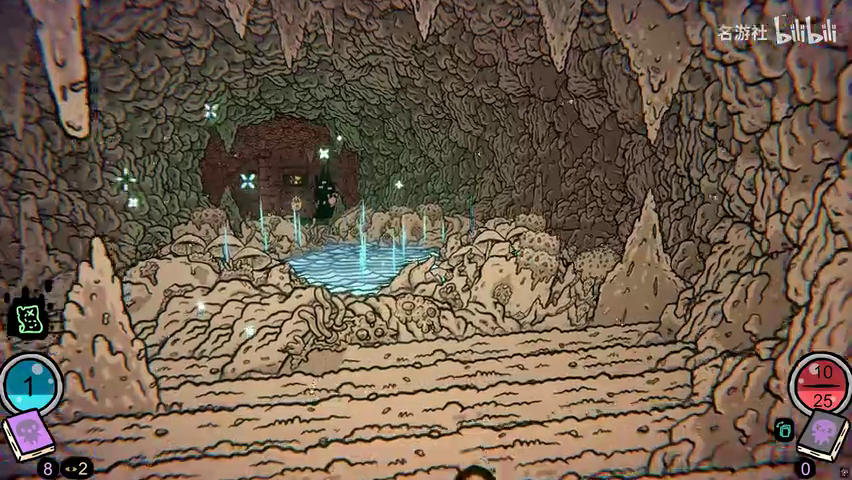
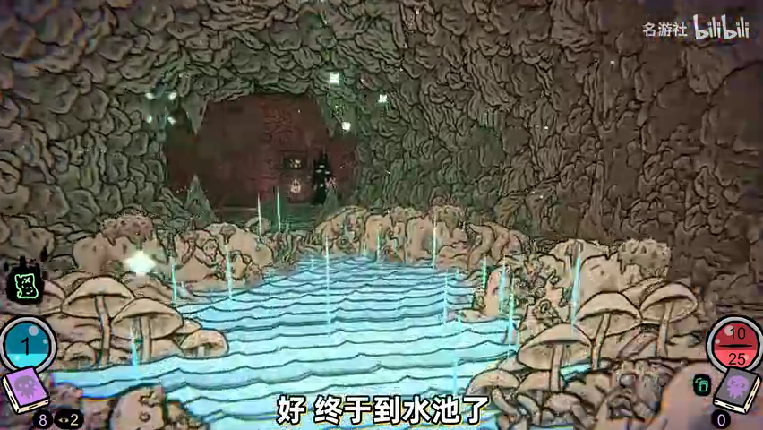
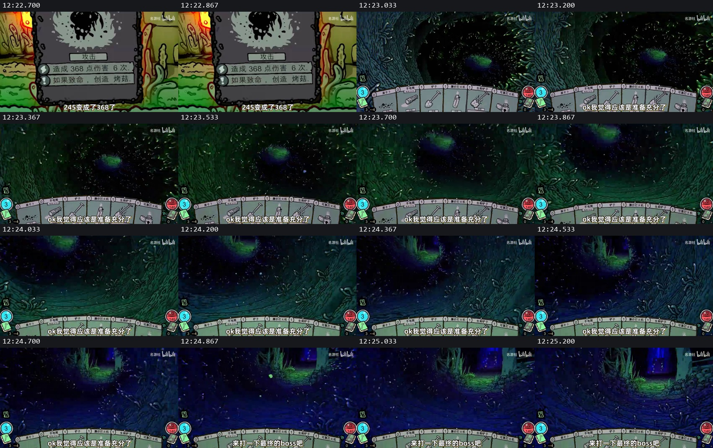
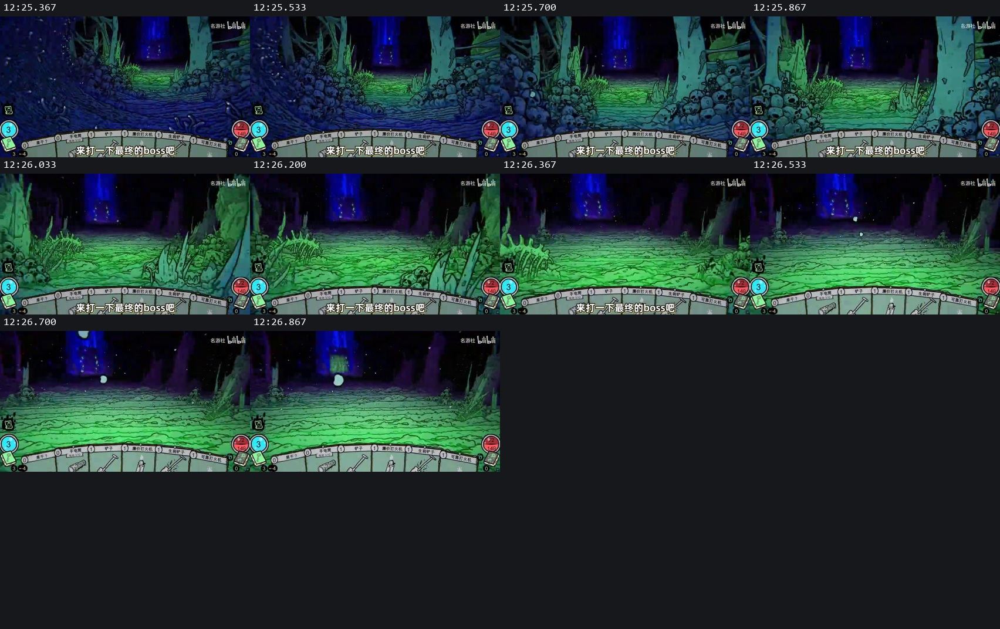

# 本地视频复核：洞穴到底提供了什么证据

2026-09-22。状态：完成全片时间索引浏览，以及下列关键运动段的抽帧检查；不是原作工程逆向，也不是本项目山洞验收。场景实施继续停止，本轮没有生成资产或修改游戏。

来源：用户保存的 [场景参考.mp4](../../tmp/场景参考.mp4)，13 分 13.77 秒，852×480，约 30 fps。[文件指纹](video-study/source.json)。[带时间定位的本地复核页](video-study/index.html)可直接播放原视频。原始 11 张参考截图及 2 张路线示意仍保存在[核心图册](CORE-REFERENCES.md)。

## 1. 最重要的修正

**视频支持的是“有连续纵深的洞腔，加上各处突出的局部构件”；不支持把它直接定性为“整张拱图重复排队”，也不支持“散石随机堆起来就会形成洞”。**

连续纵深是视觉要求，不等于已经查明原作采用连续网格、分段曲面或图片组合。仅靠这个视频，无法可靠还原源资产文件数量、网格结构、材质和生成器。后续任何人都不得把下面的构件分工写成“原作就是这么实现的”。

此前的倒 U 形整拱重复试验没有证明参考方法：有限图片外缘、层间露空、相同轮廓的等距重复仍然明显。它应保留为失败证据，不能继续作为已经成立的生产基础。

## 2. 可以复核的运动证据

| 时间 | 实际可见内容 | 可以得到的结论 | 不能得到的结论 |
|---|---|---|---|
| 01:00–01:04 | 根系通道向前移动，远门组逐渐接近，随后出现宝箱事件 | 中途事件可以占据同一条通道；近侧枝根与远景入口共同组织纵深 | 不能从这段断言任意事件都可插入任意弯道 |
| 03:31.0–03:31.5 | 门组仍在近前，右门呈暗开口 | 选择入口集中在通道末端，没有展示宽广场连接三条完整长路 | 没有验证门后是否共享空间 |
| 03:31.5–03:31.667 之间 | 门组画面变为洞穴内部 | 此处存在画面不连续，不能作为完整过门过程 | 不能据此证明游戏瞬移、转场方式或路线轴向算法 |
| 03:31.667–03:34 | 洞内向前，画面有俯仰/倾斜变化，之后敌人进入战斗画面 | 洞腔需要覆盖运动中的视野；战斗景别与行进过程有差别 | 不能把画面倾斜直接当作本项目必须采用的镜头参数 |
| 04:16.8–04:18.967 | 前往蓝色池水，近侧岩体退出画边，池岸和远洞口逐渐扩大 | 最清楚的天然洞连续前进证据，适合检查顶部、侧面与近中远衔接 | 不能从视觉上的岩块数量推算源图片数量 |
| 04:19.133 起 | 大幅放大生命值界面 | 属于解说视频的剪辑/界面展示，排除出空间分析 | 不能把这种放大算作游戏镜头运动 |
| 12:23.033–12:26.867 | 狭窄暗通道逐渐显露骨柱、绿色地面和蓝色远景焦点 | 窄入口与后续宽空间可以先后显露；不用在入口前一次展示全部空间 | 此段不是同时展示三个无门岔口的证据 |

### A. 天然洞：应重点反复观看的 2 秒

[连续抽帧](video-study/cave-forward-detail/sheet-1.jpg)，每秒 6 帧；原尺寸帧及时间见同目录 `frames.json`。

具体观察：

1. **圆形趋势不是每一层都有一根完整石拱。** 左右岩体向上内收，顶上岩纹继续向远处延伸；局部钟乳的尖端不构成整条通道的统一下边缘。不能把钟乳密度当作洞顶闭合能力。
2. **大形和点缀有不同职责。** 侧顶主体提供包围；长短不一的钟乳、石笋提供轮廓变化；池边岩块和蘑菇形成局部群落；蓝池是事件焦点。它们没有以同一间距一起重复。
3. **圆不是左右镜像。** 近右岩体与近左岩体的突出量、钟乳位置不同，远口也不严格居中；空出的通路仍然可读。对称复制半拱造成的 M 形，不属于参考所展示的洞腔关系。
4. **近景大块退出后，后面仍有岩体承接。** 这段运动中，没有出现本项目试验里那种有限拱片外边缘之间的大片灰背景。制作检查必须包括前景移出画面后的承接，不能只看停住时是否遮满。
5. **地面并非全铺小装饰。** 清楚的地面纹理提供纵深，较高装饰偏向边缘和池岸；丰富感来自形体层级与事件变化，不是每平方米塞入相同数量的小石头。

这里能提出的生产分工是：侧顶包围、局部突出轮廓、贴地连接、事件组合、稀疏发光点缀。**这是功能分类，不是“只需五张图”，也不是原作资产数量的结论。** 同一个源资产可以承担多个职责，某种职责也可能需要成组资产。

### B. 窄口后显露大空间：比扩大岔口广场更有价值

这个过程的价值是空间的**先后显露**：远处先有小片可辨识的绿色落脚区域，然后出现柱脚和骨堆，最后才展开较宽的行进视野。入口附近仍有近侧包围，宽空间的资产不必提前在入口前铺开。

这是本项目紧凑入口方案的视觉依据。转译时应先检查“从当前位置应该看到多少后续空间”，再决定预览资产的范围。不能从三个未来分支所需的宽度反推当前选择区也要那么宽。

### C. 有门与无门必须分开说

[门口到洞内抽帧](video-study/cave-entry-detail/sheet-1.jpg)。本次重点段中能够确认的是集中排列的门组；没有看到可完整证明“三条无门支路转入后归回主轴”的连续演示。

因此：有门口的紧凑视觉可向视频学习；无门口短预览、选路后恢复轴向、不可见后移除未选内容，依据的是用户路线示意和本项目产品需求。**不能借参考视频为尚未验证的无门算法背书。**

## 3. 对本项目资产与算法的直接约束

以下是从证据提出的开发要求，尚未实现或验收。

| 工作对象 | 必须明确的输入/输出 | 不应再采用的替代做法 |
|---|---|---|
| 路线 | 区分有门选择、无门预览、单通道变化、事件展开；输出可见空间的先后次序 | 所有场景统一宽广场加发散长路 |
| 镜头 | 使用已有角色占比和镜头权限，列出行进与选路的实际视野范围；只在允许范围内约束运动 | 为适配不合格资产临时扩大通道或任意旋转镜头 |
| 洞腔主体 | 对每种候选组合检查近、中、远处的内缘和遮挡连续性，说明前层离开后由谁承接 | 只检查一张整拱的静态轮廓是否像洞 |
| 构件元数据 | 地面接触位置、可见内缘、有限图片外边界、允许显示区域、连接与挂点、是否自带醒目光斑 | 按图片矩形中心摆放，之后整体下压/拉伸补漏洞 |
| 变化组织 | 分别控制洞腔尺度变化、岩体突出、局部群落、独特事件；独立于自然洞的人工梁架节拍 | 把同一组左右岩柱与顶石同步重复，再对所有物件加随机数 |
| 灯光 | 先验证结构可读，再看正式光雾能否形成近中远和事件焦点；发光点缀与高频重复主体分离 | 依赖雾掩盖大面积漏空，或让每片重复岩体都发光 |
| 验证 | 固定一个连续片段检查前景退出、顶部承接、路径显露，再比较正式光照与检查光照 | 只挑停住时好看的帧，或者不停换地图截图 |

**现阶段不能负责任地给出“洞穴固定需要多少张资产”。** 正确的计数对象先是可替换的合格组合：每个组合须独立承担明确的可见空间职责。先验证一个组合在完整运动中成立，再记录它用了哪些源图、哪些部位可复用、同屏重复哪里醒目，据此得出补充清单。未验证的张数只能算试验预算，不能写成质量标准。

## 4. 已完成与未完成

- 已完成：原视频登记；全片每 10 秒时间索引；根系接近、天然洞入场/前进、后段空间转换的重点抽帧；以上逐段视觉复核；可定位原视频的复核页。
- 未完成：原作准确资产拆分与内部算法。这些不能靠当前视频保证还原。
- 未完成：本项目洞穴新方案。现有整拱排队和拆散柱顶两条失败路线都不能宣布合格；本轮没有继续实施它们。
- 下一阶段应交付的证明：在本项目实际镜头下，一个短段连续前进与一次紧凑选路，证明圆形洞腔、顶部承接和路径显露同时成立。该证明完成前，不把拟议的构件数量和排列方法推广给其他场景。

## 证据目录

- 全片索引：[1](video-study/overview-1.jpg)、[2](video-study/overview-2.jpg)、[3](video-study/overview-3.jpg)、[4](video-study/overview-4.jpg)。
- 低频重点段：`video-study/root-approach/`、`cave-entry/`、`cave-exit/`、`final-door/`。
- 高频重点段：`video-study/cave-entry-detail/`、`cave-forward-detail/`、`hall-transfer-detail/`。
- [抽帧工具](../../scripts/analyze_scene_reference_video.py)只读取原视频，输出未经改动的原尺寸帧和带时间标签的缩略索引，不改变游戏或源视频。
