# 通道空间与岔路组织参考图册

统一入口已更新为 [核心参考文档](../CORE-REFERENCES.md)，包含本册全部 11 张原图及用户新增的岔路、单通道两张示意。此目录保留原始归档。

用户提供，归档日期：2026-09-21。用途：本项目内部美术与算法学习。原作画面不是本项目可直接入库的游戏资产。

来源：[菇域幽城视频 · 名游社](https://www.bilibili.com/video/BV15dY16MEaE/)。图像保留用户提供的原始内容，包括界面、字幕和标注。

## 使用原则

- 学习空间组织，不临摹画面；保留本作风格、第三人称镜头、队伍站位和性能约束。
- 森林是本作已基本达标的参照，其他类型不能因为流程运行就称为达标。
- 学习近景包围、中景连续、远景入口，顶部层叠、附着装饰以及紧凑选择节点。
- 图中偏狭窄室内，不能直接换算本作米制宽度；截图也不能证明原作实现了真实三维岔路。
- 不得据此新增连续左右墙；顶部是否补实以正式光照与允许的照明变化为依据。

## 逐图学习

### 图1 · 木架通道

重复立柱与横梁建立高度和纵深参照；火把依附支撑向通道伸出。

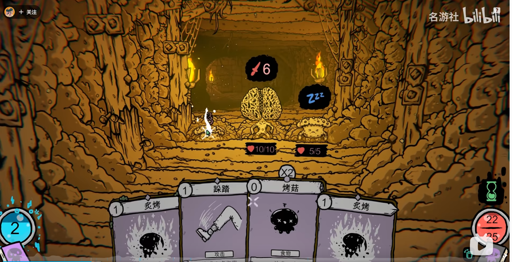

### 图2 · 根系开口

两侧厚实根系形成包围，中央留出安静背景；不是所有顶部都必须无缝封闭。

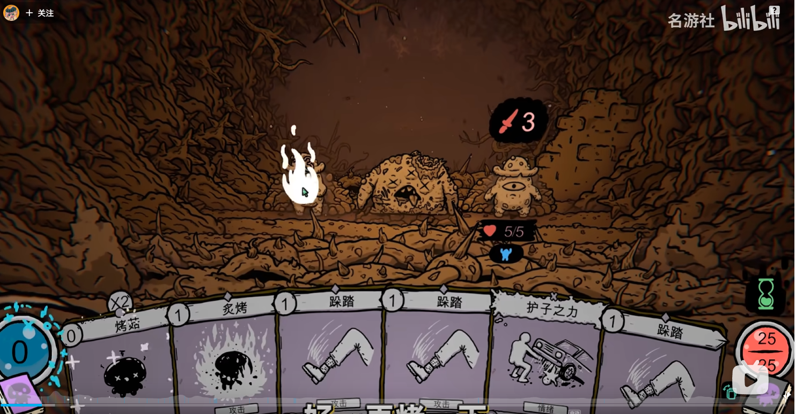

### 图3 · 远景选择入口

近中远层叠轮廓包住远端小入口，远处选择没有撑大近处通道。红箭头是用户的标注。

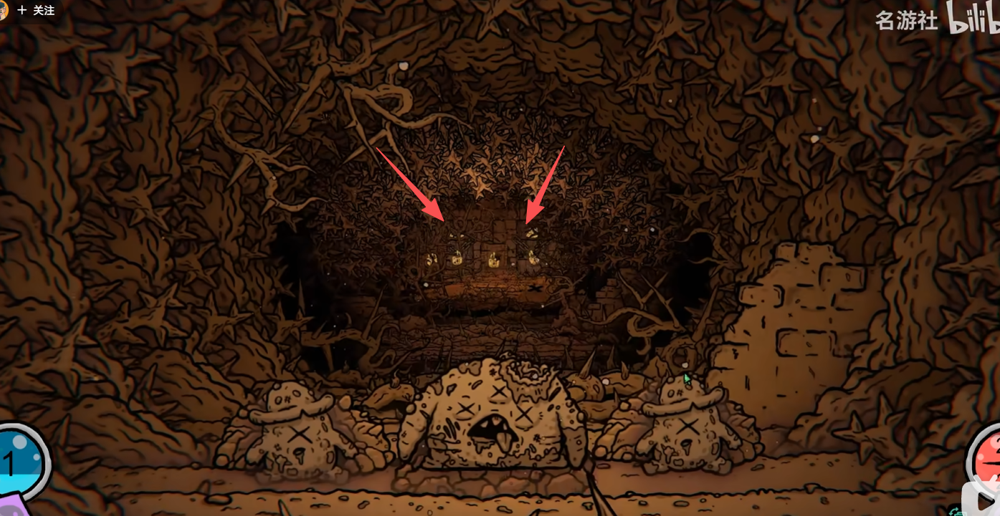

### 图4 · 接近选择节点

侧面枝条伸入画幅，远端门组提供目标；近侧结构持续存在。

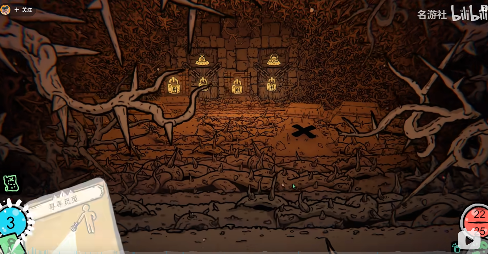

### 图5 · 休整节点

功能节点继承通道的尺度与包围，不因交互变成空广场。

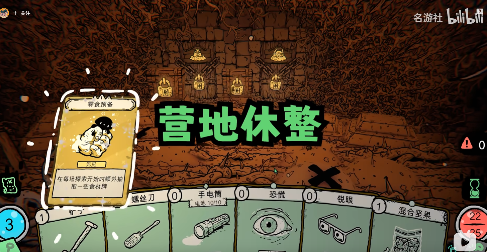

### 图6 · 开启的侧口

多个入口共享紧凑的远端区域；门后路线不能仅由截图推断。

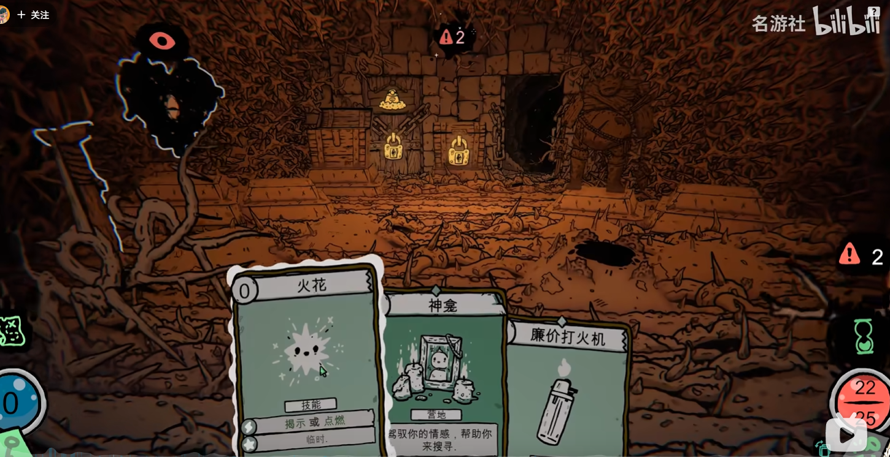

### 图7 · 商店组合

顶梁、柜台、挂货组成有功能和附着关系的整体，不能用随机小道具代替。

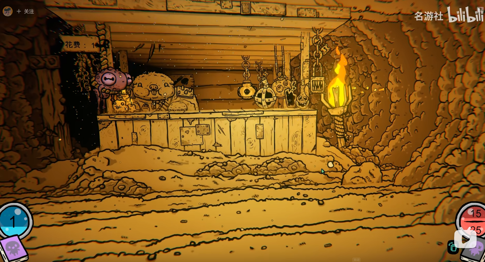

### 图8 · 双入口与梁架

入口数增加不等于通道按数量加宽；顶部层次仍保持。

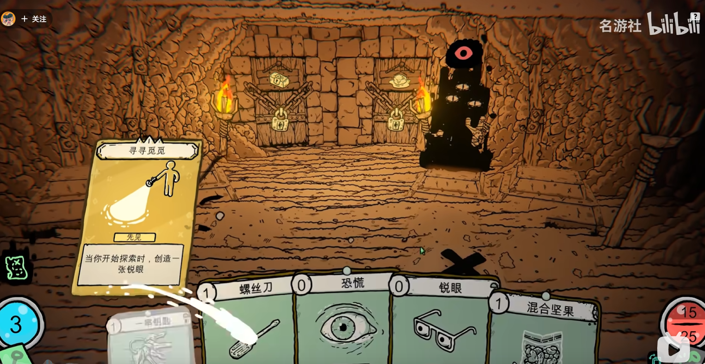

### 图9 · 天然岩洞

岩肩、顶岩、钟乳和岩脚分工；不规则层叠轮廓形成洞穴纵深。

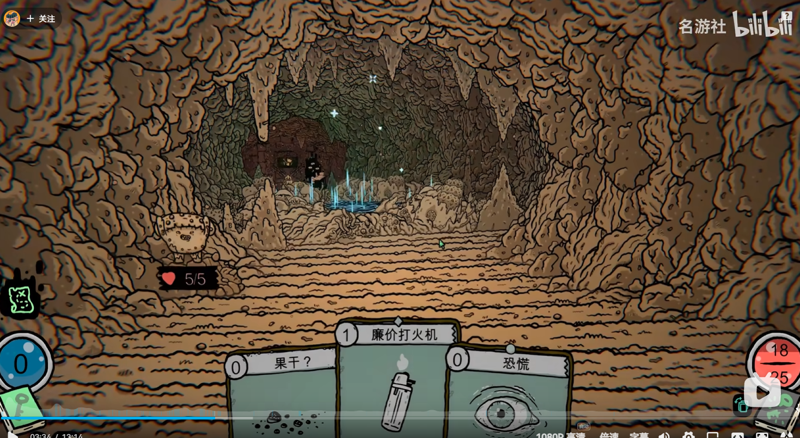

### 图10 · 三入口与光色

三处远端入口共享空间，局部暖光与环境冷色分工；不能直接照搬色调。

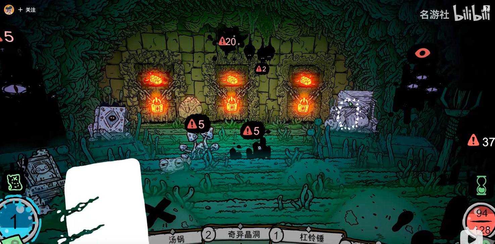

### 图11 · 开放顶部

没有连续顶面，粗大近景立柱、根部组合、纵深重复和远处目标仍建立通道感。

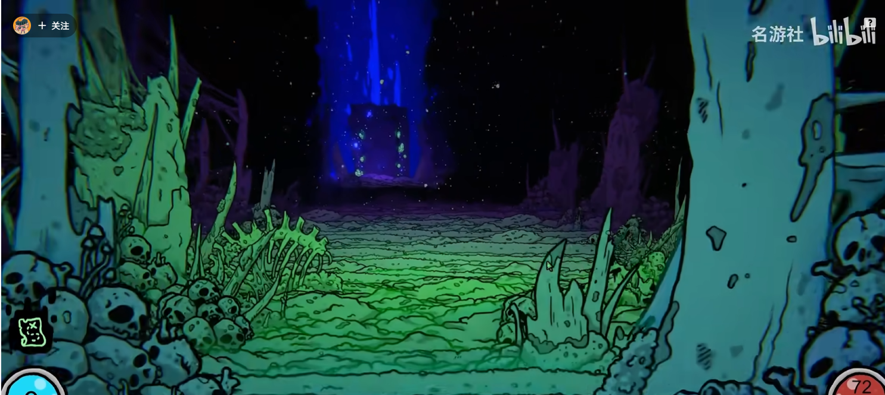

## 用于生产前的检查

1. 先选择路径组织和结构截面，不先随机撒物。
2. 逐项核对落地支撑、单侧拱肩、顶块、附着物、功能组合是否齐备。
3. 路口保护实际通行带，不把所有出口外围连成清空广场。
4. 检查入口、选择、左右转入、战斗；维持近景和顶部层次。
5. 明亮诊断用于定位，正式光照用于视觉裁决。
6. 缺少结构资产则生成；比例不适配则替换，禁止靠横向拉伸完整拱解决。
